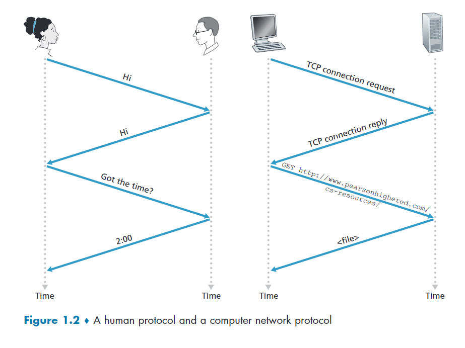

# 第一章 `page 0~80`

## 1.1 什麼是網路

### 1.1.1 簡單概述

> 網路是由許多不同的裝置，在世界各地連結起來的概念。這些裝置被稱為`hosts`或`end systems`。

- `hosts`之間以`communication links`和`packet switches`連結和通訊
- `transmition rate`單為是 bit/s。Ex: 100Mbps 為 100M bits per second (這也是為什麼mbps換算下載速度大概是除以8)

### 1.1.3 什麼是協定(Protocol)

> 協定是電腦傳輸訊息的一種規範，它定義了訊息的`format`、接收`order`、以及`actions taken`。

## 1.2 邊緣網路(The network edge)

### 1.2.1 網路存取

存取方式                     | 常用地方                         |補充
----------------------------|---------------------------------|------
DSL(digital subscriber line)|居家網路            |ADSL 就是其中一項 DSL 的技術
Cable                       |居家網路            |就是第四台，有分同軸電纜或光纖
Ethernet                    |較大型機構 或 居家網路|
3G/4G/5G Wifi               |行動通訊            |

### 1.2.2 實體媒介

> 資料在不同的 rounter 間不斷輸送，最後到達目的地。

- Guilded media (實體線材)
    - fiber-optic cable (光纖)
    - twisted-pair copper cable (雙絞線)
    - coaxial cable (同軸電纜)
- Unguided media (非實體線材)
    - wireless LAN
    - satellite

## 1.3 網路核心

### 1.3.1 分封交換(packet switching)

1. #### 儲存並轉發(Store-and-forward transmission)

訊息在傳輸中會被切成小片段，這些片段又被稱為`封包(packet)`，封包的最大大小為 1500 bytes。訊息的`傳輸速率(transmission rate)`，又被稱為`頻寬(bandwidth)`，或是`capacity`。Router 在經過特定的 routing algorithm 後產生 `forwarding table`，再藉由封包上的目的地 id 來查 `forwarding table`，決定怎麼走。

> ，用頻寬 R bit/s 傳輸 L-bit 封包的時間公式。

2. #### 佇列(Queueing)

當封包抵達的速度大於處理的速度時的動作。當封包暫存(buffer)溢出時，即`丟失封包`。

### 1.3.2 線路交換(Circuit Switching)

將 link 切割成多段線路，這樣就能多線路傳遞資料，使用中的線路會被`獨佔`，在結束使用後線路會被`釋放`。

通常使用在傳統的電話線上。

