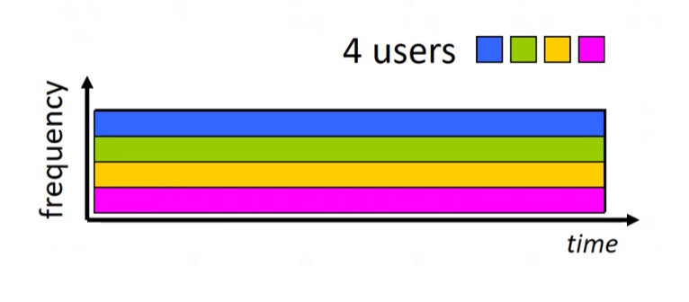
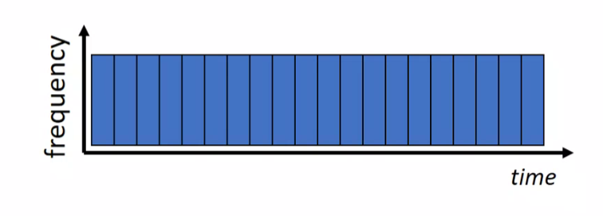
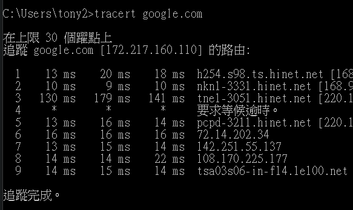

# 第一章 `page 0~80`

## 1.1 什麼是網路

### 1.1.1 簡單概述

> 網路是由許多不同的裝置，在世界各地連結起來的概念。這些裝置被稱為`hosts`或`end systems`。

- `hosts`之間以`communication links`和`packet switches`連結和通訊
- `transmition rate`單為是 bit/s。Ex: 100Mbps 為 100M bits per second (這也是為什麼mbps換算下載速度大概是除以8)

---
### 1.1.3 什麼是協定(Protocol)


> 協定是電腦傳輸訊息的一種規範，它定義了訊息的`format`、接收`order`、以及`actions taken`。


## 1.2 邊緣網路(The network edge)

### 1.2.1 網路存取

存取方式                     | 常用地方                         |補充
----------------------------|---------------------------------|------
DSL(digital subscriber line)|居家網路            |ADSL 就是其中一項 DSL 的技術
Cable                       |居家網路            |就是第四台，有分同軸電纜或光纖
Ethernet                    |較大型機構 或 居家網路|
3G/4G/5G Wifi               |行動通訊            |

---
### 1.2.2 實體媒介

> 資料在不同的 rounter 間不斷輸送，最後到達目的地。

- Guilded media (實體線材)
    - fiber-optic cable (光纖)
    - twisted-pair copper cable (雙絞線)
    - coaxial cable (同軸電纜)
- Unguided media (非實體線材)
    - wireless LAN
    - satellite

## 1.3 網路核心

### 1.3.1 分封交換(packet switching)

1. #### 儲存並轉發(Store-and-forward transmission)

訊息在傳輸中會被切成小片段，這些片段又被稱為`封包(packet)`，封包的最大大小為 1500 bytes。訊息的`傳輸速率(transmission rate)`，又被稱為`頻寬(bandwidth)`，或是`capacity`。Router 在經過特定的 routing algorithm 後產生 `forwarding table`，再藉由封包上的目的地 id 來查 `forwarding table`，決定怎麼走。

> ，用頻寬 R bit/s 傳輸 L-bit 封包的時間公式。

2. #### 佇列(Queueing)

當封包抵達的速度大於處理的速度時的動作。當封包暫存(buffer)溢出時，即`丟失封包`。

約可乘載 35 人。

---

### 1.3.2 線路交換(Circuit Switching)

將 link 切割成多段線路，這樣就能多線路傳遞資料，使用中的線路會被`獨佔`，在結束使用後線路會被`釋放`。

#### 多工(Multiplexing)
- **FDM(frequency division multiplexing)**: 將一區間頻率切成 n 等分，這樣就能給 n 個使用者利用，缺點是頻寬只有全部的 `1/n` 且會占用通道，優點是可以長期使用頻道 。 



- **TDM(Time division multiplexing)**: 把時間切成 n 等分，缺點是有時間限制，優點是可以利用瞬間的大頻寬來傳送資料且可以較多人使用。



通常使用在傳統的電話線上。約可乘載 10 人。

---
### 1.3.3 網路的網路

#### ISP(internet service provider) 網路服務提供者

所有要上網的 host 都要經由 ISP 提供的服務才能連線。`Conten provider`也需要連上 ISP 的服務才能提供內容，例如 Netflix 也需要透過網路業者的服務才能提供內容給成千上萬的使用者，也就是說任何兩台電腦若要用網際網路連線都需要 ISP 當 relay 才可以。

#### Global ISP

ISP 在全球有成千上萬個，如果每一個 ISP 之間都連線的話會有 `C(n, 2)` 個線段，建置成本太高，這時候 Global ISP 就可以當中間 relay，減少建置成本，或者說 `Global ISP 是 ISP 的 ISP`。

#### Tier 1 ISP

大型的電信公司，通常是指國家級的、或者是跨洲際的，如中華電信 Hinet、Google 等

#### Regional ISP

比 Tier 1 ISP 小一點的 ISP。

## 1.4 延遲、封包遺失、流量

### 1.4.1 Packet-switched 網路的 delay

#### Queuing delay

封包送到一個目的地的時候，會先經過路由器，路由器會判斷這個資料能不能送出，若不能送出，則先放入 queue 中，這個封包從排隊到 pop 出 queue 的時間稱為 `Queuing delay`。

#### Transmission delay

這個常與`Propagation delay`搞混，`Transmission delay`是指說要把資料從路由器推進到網路所花的時間，假設`一筆資料 10Mb`，`一條網路為 100Mbps 速度`，那麼把這 10Mb 推進去網路的時間為`0.1s`，這`0.1s`就是`Transmission delay`。

#### Processing delay

當封包送到路由器後，路由器要解析這個封包接下來要往哪裡送，這段解析時間稱為 `Processing delay`。為固定值，通常會被忽略。


#### Propagation delay

封包決定好路徑好，接著由 A 送到 B 的距離為 L m，訊息由實體媒介傳送，速度約為`2 * 10^8 m/s`，則傳遞時間`L / (2 * 10^8)`稱為`Propagation delay`。

---
### 1.4.2 Queuing delay 和 封包遺失

#### 流量強度(Traffic intensity)

設`a`為一秒鐘到達的封包數量，`L`為一個封包的長度(bits)，則總資料大小為`a*L`，假設頻寬為`R`，那麼`a*L/R`就是所謂的`流量強度`。

流量強度被用來評估`Queuing delay`是個很重要的指標。

- 流量強度 ~ 0: `queuing delay`趨近 0
- 流量強度 -> 1: `queuing delay`長
- 流量強度 > 1: `queuing delay`接近無限


#### 封包遺失(Packet loss)

當在路由器存 queue 的時候，若存儲的記憶體滿了，新來的封包會被`dropped`，就會造成`封包遺失`。通常封包遺失後，來源端會再重新寄送一次，或者就讓它遺失。

---
### 1.4.3 點到點延遲

#### Traceroute

在 windows cmd 打上 
```bash
tracert goole.com 
```
可以用來追蹤從這台電腦到 google 中間經過了多少 relay。



---
### 1.4.4 流通量(Throughput)

流通量是指從傳送端到接收端的速度 bits/time。假設傳輸路徑為 `A->B->C`，`A->B`的流通量是 `10 bits/s`，`B->C` 的流通量是 `100 bits/s`，那麼`A->C`的流通量就是 `10 bits/s`。

- **瞬間**: 在某一時間下的傳輸速度。
- **平均**: 在一頓時間下的傳輸速度。

#### 瓶頸 link (Bottleneck link)

在多段 links 中，流通量最小的 link 就叫做 `Bottleneck link`。

## 1.5 協議層與服務 Model

Model 化的好處是可以較容易的維護不同的網路功能。常見的資料分層為如下：
| 層                  | 例子                   |
|---------------------|------------------------|
| 應用層(Application) | HTTPS, IMAP, SMTP, DNS |
| 傳輸層(Transport)   | TCP, UDP               |
| 網路層(Network)     | IP, routing protocols  |
| 連接層(Link)        | Wifi, ethernet         |
| 實體層(Physical)    | bits on the wire       |

**ISO/OSI**

| 層                 |
|--------------------|
| 應用層(Application) |
| 表示層(Presentation)|
| 會話層(Session)     |
| 傳輸層(Transport)   |
| 網路層(Network)     |
| 連接層(Link)        |
| 實體層(Physical)    |


## 1.6 資安

常見的攻擊手段有:

- **攔截封包**: 攔截封包並偽造身分，網伺服器送資料，伺服器就會傳資料回來以竊取資料。工具: Wireshark。
- **阻斷式攻擊(DOS)**: 利用殭屍電腦往伺服器送垃圾封包，癱瘓主機使其無法正常運作。

常見的防禦手段有:

- **認證(Authentication)**: 用來認證身分。例如: 硬體的 sim 卡。
- **保密(Confidentiality)**: 利用加密保護資料。例如: RSA，公鑰私鑰等機制。
- **完整性檢查(Integrity checks)**: 數位簽章等機制。
- **存取限制(Access restriction)**: 以密碼保護的VPN之類的。
- **防火牆(Firewalls)**: 過濾進來的封包，針對特殊的封包做反應。