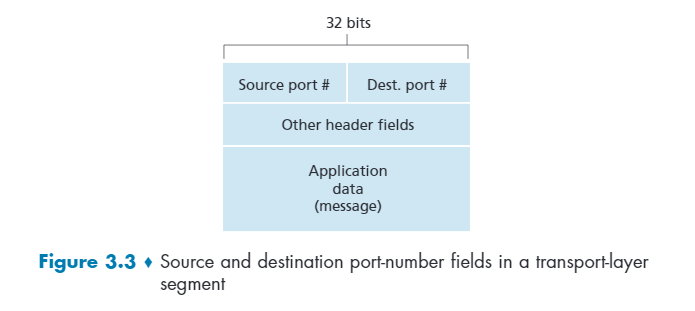
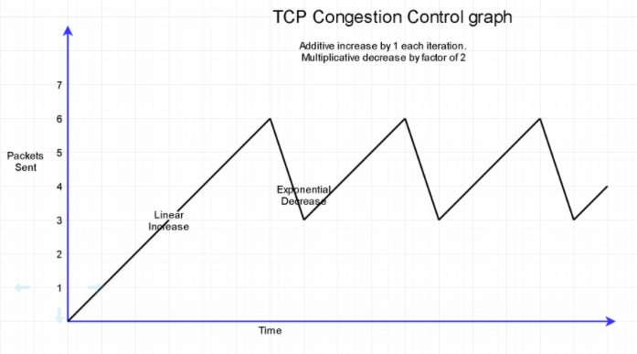

# Transport Layer(傳輸層服務)

## 3.1 Introduction and Transport-Layer Services

傳輸層協議在不同 host 的應用程式提供 `logical communication`，除此之外，傳輸層不在 router 中被實作，而是在 host 端點被實作，router 只有負責到網路層而已。

傳輸層協議將應用層的訊息切割成不同 packet，在傳輸層又被稱為 `segment(線段)`，並附上傳輸層的 `header`，再往下傳給網路層來處理，最後將資料送到對方後再一層一層往上包裝。

### 3.1.1 Relationship Between Transport and Network Layers

#課本在這邊用舉例方式說明，這邊就不贅述。

### 3.1.2 Overview of the Transport Layer in the Internet

> 由於網路層 (IP 那一層)只有做到 `best-effort delivery service`，但它不保證資料正確性、順序性，所以網路層是 `unreliable service`。傳輸層就是以網路層的基礎下做延伸的。

#### 主要兩大協議: TCP, UDP[兩個介紹可以到第二章](../chapter-2/Application%20Layer.md)

- UDP: 提供`資料正確性檢查(data integrity)`及`錯誤偵測(error detection)`，但不保證資料能夠送到。
- TCP: 是 reliable data transfer，並且提供`壅塞控制(congestion control)`。

這兩個協議不提供:
- delay guarantees
- bandwith guarantees

## 3.2 Multiplexing and Demultiplexing

一個 `Process` 可以有多個 sockets，已經知道應用層的訊息傳到傳輸層會附加上 `header`，這個 header 就是用來給傳輸層判斷要把哪個資料傳到哪個 socket。

header 內部的資料有`傳輸層協議的 identifier`、`來源 port`、`目的地 port`...等。

在傳送端，傳輸層將上層的資料切成 segment 並且加上 header 接著送往網路層，這個動作被稱為 `multiplexing(多工)`；在接收端，傳輸層依據 header 的內容將資料送到正確的 port，這個動作被稱為 `demultiplexing(解多工)`。

在[上個章節](../chapter-2/Application%20Layer.md)有提到 port number 的範圍是 0~65535。port 0~1023 都是 `well-known port numbers`，並且通常不讓 client 來使用(restricted)。

#### Connectionless Multiplexing and Demultiplexing(UDP)

UDP socket 只需要一個 `2-tuple` 來辨識就可以: `(目的地 ip, 目的地 port)`，來源端 IP 和 port 可能會不同，但是最後一定會送到相同的 socket，只要 2-tuple 相同就好。

#### Connection-Oriented Multiplexing and Demultiplexing(TCP)

TCP socket 需要 `4-tuple` 來辨識: `(來源 ip, 來源 port, 目的地 ip, 目的地 port)`。一個 server 會 handle 許多不同的 TCP connection，這時候就會用到 4-tuple 來區別不同的資料要送哪些 port。

## 3.3 Connectionless Transport: UDP

UDP(User Datagram Protocol) 沒有握手程序，每個封包都是獨立的，不保證資料正確性以及順序性，也沒有 congestion control，沒有 RTT。

UDP有以下特點
- **Finer application-level control over what data is sent, and when**: 相比 TCP 來說，它可以更快的送出資料，並且在壅塞時仍然可以運作，而不像 TCP 需要一直重傳，對於需要低延遲且資料正確性為其次的應用程式來說是更好的選擇，例如串流。
- **No connection establishment(不需要連線建立)**
- **No connection state(無連線狀態)**: 管理成本低，相比 TCP 來說更有可能同時管理更多活躍用戶。
- **Small packet header overhead(header 小)**: TCP header 要 20 bytes，UDP 只要 8 bytes

使用UDP的例子: DNS, SNMP, HTTP/3。

### 3.3.1 UDP Segment Structure

UDP segment 的資料架構如下圖

- source port: 來源 port
- Dest. port: 目的地 port
- Length: 資料長度，單位是 bytes
- checksum: 用來做初步的錯誤檢測用的
- Application data: 主要訊息

### 3.3.2 UDP Checksum

checksum: 判斷傳出去的資料有沒有發生錯誤，利用 1 補數來加法，未必能夠完全判斷資料是正確的(可能跳位跳太多，導致算出來的結果仍然是正確的)，若要做更多的檢查要在應用層做(HTTP/3)。

[**checks sum 練習題**](https://gaia.cs.umass.edu/kurose_ross/interactive/internet_checksum.php)

## 3.4 Principles of Reliable Data Transfer

應用層之間底層的傳輸如果可以確保資料的正確性以及順序性，那就稱為 reliable data transfer(rdt)。由於網路層是不可靠的，所以要實作必須在傳輸層。

### 3.4.1 Build a Reliable Data Transfer Protocol

#### Reliable Data Transfer over a Perfectly Reliable Channel: rdt1.0

資料流向只考慮單向，那 perfectly reliable channel 的 FSM(finite state machine)是非常簡單的，如下圖。

封包不會遺失，沒有bit error。

#### Reliable Data Transfer over a Channel with Bit Errors: rdt2.0

實際上的應用不會像前面的 rdt1.0 那麼美好，在傳遞的過程中可能會有資料遺失，這時就要用到 `error check` 的功能了，這邊稱 rdt2.0。

在 rdt 協議中，接收者如果每次收到訊息都會回應一個 "OK"(positive acknowledgments)，如果接收到亂碼，則要求傳送端再次傳送(negative  acknowledgments)。有這種功能的協議被稱為 `ARQ(Automatic Repeat reQuest) protocols`。

ARQ 的三個基本需求
- **Error detection**: 一種用來檢查錯誤的機制，例如 UDP 的 checksum。
- **Reveiver feedback**: 能夠告訴 sender 的回應，有分為 ACK(postive) 和 NAK(negative)。
- **retransmisstion**: 資料的重新傳送。

---
下圖為 rdt2.0 的 FSM

**註: Λ 代表 empty action**

由上面狀態圖可以發現，只要接收端還沒收到正確的資料，那狀態就會一直再重傳，無法傳下一個packet，因此 rdt2.0 是一個 `stop and wait protocol`。

解決辦法是，可以將封包加上 `sequence number`，這樣如果重傳，接收端可以直接捨棄，不將重複的資料網上傳。

rdt2.0 聽上去很不錯，但是有致命的問題是，**如果 ACK 或 NAK 發生錯誤了，那麼這個 FSM 會無法辨識接下來要怎麼走**。

---
#### rdt2.1

下圖為 rdt2.1 的 FSM

由於 rdt2.1 是個 `stop and wait` 的運作方式，所以**只需要 sequence number 0 and 1 就夠了**。

基本上 rdt2.1 FSM 就是為了 sequence number 的 0 和 1 增加狀態，可以發現 0 和 1 的 state transition functions 都很相近。

---

#### rdt2.2

下圖為 rdt2.2 的 FSM

基本上和 rdt2.1 是一樣的，只是在傳送端的 ACK 判斷新增了 `sequence number` 的判斷而已，以及等待端把自身 loop 的 transition function 合併而已。

---
#### rdt3.0

在前面的 rdt 版本中，只有考慮資料正確的檢查，沒有考慮資料在傳送中遺失的可能，因此 `rdt 3.0` 引入了 **timer** 的機制，如果資料在特定時間內未送到，那麼傳送端就需要再度重傳。

如果資料超出那段「特定時間」卻還是被送到，那麼接收端回傳的 ACK 則根據 `sequence number` 來判斷是否重複。由於 rdt 3.0 的 `sequence number` 會在 0 和 1 不同變動，它又有被叫做 `alternating-bit protocol`。

### 3.4.2 Pipelined Reliable Data Transfer Protocols

不難發現 rdt3.0 效能是非常差的。因為要等待的時間會佔據太多時間消耗的比例，導致效率很差。可以從以下例子來看：

---

*若 A 點和 B 點的 link 頻寬為 1 Gbps(10^9 bits/sec)，假設傳輸的封包為 1 Kb(10^3\*8 bits)，可以知道 transmission time 為*

*如果 RTT 時間為 30 ms，那麼傳輸時間的整體利用率為*

***換句話說就是有 99.973% 的時間都在等待。***

---

解決方法是傳送端可以一次傳多筆資料，這種方式被稱之為 `Pipelining`。然而一次送出多筆封包，可能有很多封包出錯或遺失，此時有兩種方法，第一種被稱之為 `Go-Back-N(GBN)`，第二種被稱為 `Selective Repeat(SR)`，兩者皆有各自的優點，所以要依據場合來決定要用哪一種方式。

### 3.4.3 Go-Back-N(GBN)

GBN 的特點是它會一次把 N 筆資料框起來，並且用**一個計時器**來計算這 N 筆資料的 timeout 時間。

對於接收端來說只要收到有 gap，那麼 gap 後半部都會被 discard 掉，而中間空缺的封包則是利用 timeout 的方式再重傳。

一般這個 N 又稱之為 window-size，因為像是窗戶在滑動一樣，這種方式又稱為 window-sliding。

由於不太好描述，所以[**這邊有個很讚的網頁互動動畫**](https://www2.tkn.tu-berlin.de/teaching/rn/animations/gbn_sr/)，可以點擊封包來中斷傳輸。

### 3.4.4 Selective Repeat(SR)

SR 的特點一樣是把 N 筆資料框起來，但是**每一筆資料都有自己的 timer**。如果前面有 gap，它會先把 gap 後已經送達的資料先 buffer，而 gap 的封包會因為 timeout 而再度重傳，假設 gap 的封包填補起來了，那麼 buffer 的封包會一直被處理，直到又出現 gap。

同 GBN，[**這邊有個很讚的網頁互動動畫**](https://www2.tkn.tu-berlin.de/teaching/rn/animations/gbn_sr/)。

sequence number 通常是 window size 的倍數，才不會有編號重複的問題。

## 3.5 Connection-Oriented Transport: TCP

### 3.5.1 The TCP Connection

> TCP 協議有以下特點
> 
> - point-to-point: 一個接收端，一個傳送端
> - reliable, in-order byte stream: 確保資料的正確及順序性
> - full duplex data: 可以雙向傳資料
> - flow control: 流量控制，避免接收端撐不住
> - three-way handshake: 三次握手

### 3.5.2 TCP Segment Structure

- header 部分
  - **source and dest port**: 來源以及目的地的 port，分別都為 16 bits
  - **sequence number**: 2^32 bit: rdt 需要用到的參數
  - **ack number**: 2^32 bit: rdt 需要用到的參數
  - **header length**: 4 bits: 表示 tcp header 的大小
  - **receive window**: 16 bits，表示可以接受的資料量，用來做 flow control 來用的
  - **flag field**: 6 bits，每個 flag 分別有自己的涵義
    - **ACK**: 表示 ack field 裡的值是否為合法(待確認)
    - **RST**: 表示這個 TCP 連線是否該被立即中止
    - **SYN**: 用在握手連線過程中的 flag
    - **FIN**: 表示是否為 sender 的最後一個封包
    - **PSH**: 表示是否要將資料直接往應用層傳，也就是不管 buffer 有沒有滿，直接把 buffer 裡的資料都往上傳
    - **URG**: 表示此封包是否為緊急封包，優先處理
  - **checksum**: 16 bits，做簡單的錯誤檢查用的
  - **options**: 預留的部分，可以用來延伸
  - **urgent data pointer**: 16 bits，用來表示資料某一段是緊急優先的，pointer 指向緊急資料的結尾
- body 部分
  - **data**: 應用層的資料

seq 和 ACK 在兩端是相反的

### 3.5.3 Round-Trip Time Estimation and Timeout

在 `GBN` 或 `SR` 的方法中都有用到 timer 的功能，因此設定 timeout 的合理性影響了整體傳輸的效率，若 timeout 設**太短**則**重傳會太多次**；設**太長**則**反應速度太慢**。

最直接的方法就是直接測試 RTT 的傳輸時間，然而真實的情況 RTT 是會大幅度波動的，因此需要有一個方法來在大幅度波動的中間找一個估計值。評估公式如下：

---

利用 `SampleRTT` 來測量兩端的 `RTT`，由於 `SampleRTT` 會大幅度變動，因此需要減緩幅度。利用遞推方式來減緩。

%20\times%20EstimatedRTT%20+%20a%20\times%20SampleRTT)

通常 a 會是 `0.125`。

然而這個 `EstimatedRTT` 算出來的是平均值，不一定真的大於 `RTT`，因此需要再加上一個值 `DevRTT` 來確保 `TimeoutInterval` 真的會大於 `RTT`。

%20\times%20DevRTT%20+%20b%20\times%20\left\|%20SampleRtt%20-%20EstimatedRTT%20\right\|)

通常 b 會是 `0.25`。

---

### 3.5.4 Reliable Data Transfer

TCP sender Pseudo code: 

#### TCP fast retransmit

避免完全等待 timeout 的時間，可以透過某些機制來提早偵測並重傳。若收到相同的 `ack` 多次，那就直接重傳，不用等 `timeout` 的時間到。

#### Doubleing The Timeout Interval

(有空再補)

### 3.5.5 Flow Control

TCP 的另一個功能是 **Flow Control**，為了避免傳送端資料太快，接收端來不及處理而被 buffer 給丟棄，TCP segment structure 中的 `recv window` 就是用來告知傳送端「接收端這邊的 buffer 還有多少」，藉以給傳送端限定傳送量。

假設 A 主機要送 B 主機資料。主要有這些參數:
- `LastByteRead`: B 主機最後一個從 buffer 收到的 byte
- `LastByteRcvd`: B 主機最後一個接收並放在 buffer 的 byte 
- `rwnd`: 就是 `recv window`，指接收段這邊的 buffer 還有多少
- `RcvBuffer`: 整個 buffer 的大小，可以由程式的 `socket options` 來調整，一般都是作業系統會自己決定
- `LastByteAcked`: 最後一個被 ACK 的 byte

---

#### B 主機端 (接收端)

由於不能夠 overflow，因此

，而 `rwnd` 為

---

#### A 主機端 (傳送端)

已知

 是指已經送出，但還未被 ack 的資料量。

那麼就需要確保這個數量不會超過 rwnd，不然接收端可能會 buffer overflow。

---

然而會有一個問題發生，如果 B 主機的 buffer 滿了，那麼 B 會告訴 A `rwnd=0` 了，理所當然 A 就不會再送資料了。但是假如 B 之後就再也沒送資料給 A 時(**注意 TCP 是雙向溝通的，A 可以給 B，B 也可以給 A**)，那麼 A 的 `rwnd` 會一直維持 0，也就是整個卡住了。因此在實務上若 `rwnd=0` 時 A 會需要一直向 B 傳送一個 1 byte 的資料，用來更新 `rwnd` 的值。

### 3.5.6 TCP Connection Management

在交換控制訊息時，會先三次握手來建立連線。

步驟如下

---

1. 客戶端向伺服端發送一個 `TCP segemnt`，在這個 `TCP segment` 中 `SYN` 這個 flag 被標記成 1，並且隨機挑選一個數字 `client_isn` 作為初始的 `sequence number`，並放入這個 `segment` 裡面。
2. 當伺服端收到這個 `TCP segment` 後，伺服器會分配 buffer 空間以及各種參數。並且再向客戶端送出另一個 `TCP segment`，在這裡 `SYN` 被設為 1、`ACK` 被設為 1，且 `ack number` 也被設為 `client_isn+1`。最後伺服端隨機選一個數字 `server_isn` 將其放入 segment 中的 `sequence number`，這種 segment 又被稱為 `SYNACK segment`。
3. 客戶端收到 `SYNACK segment` 後也自己分配 buffer 和參數。並且回傳最後一個 segment，裡面的 `SYN` 被設為 0 (因為TCP 已經建立)，並且 `ack number` 設為 `server_isn+1`，告訴伺服端有收到訊息。雙方接著就可以傳遞訊息了。

---

最後斷開 TCP 連線時的步驟如下

---

1. 其中一端 (A) 向另一端 (B) 發送中斷的 segment，這個 segment 的 `FIN` 被設為 1。在這個時候 A 端進入 `FIN_WAIT_1` 狀態。
2. 當 B 接收到中斷的 segment 後，B 會回傳 A 一個 `ack segment`，這時 B 端進入 `CLOSE_WAIT` 的狀態。
3. 當 B 決定也要中斷時，B 向 A 發送 `FIN` 為 1 的 segment，並進入 `LAST_ACK` 的狀態。
4. 當 A 收到 B 的 segment 後，也會回傳一個 ACK，至此兩方都將資源都釋放掉。 

---

## 3.6 Principles of Congestion Control

跟 flow control 不一樣，flow control 只有考慮 TCP 兩端，Congestion control 是考慮多個 hosts 在 link 中間傳輸的過程。

### 3.6.1 The Causes and the Costs of Congestion

#### Two senders, a router with infinite buffers

假設 router 的頻寬是 R，那麼一個 sender 分配到的頻寬就是 R/2，當兩個的流量超過 R 時，會被存進 infinite buffer，由於是 infinite 的，所以不會一直重傳，只要排隊就好。

#### Two senders a router with finite buffers

跟無限一樣，只是 buffer 會滿，可能資料會遺失，這樣需要再重傳，會浪費頻寬。

#### Four senders, routers with finite buffers and multihop paths

資料的重傳會需要再經過好幾個 routers，造成網路更雍塞。

### 3.6.2 Approachees to Congestion Control

兩種方式，第一種是傳送端接收端來觀察網路用塞程度 (***End-to-end congestion control***)，第二種是 router 增加額外功能，修改封包內容，並觀察網路雍塞程度，進而告訴傳送端 (***Network-assisted congestion control***)。

## 3.7 TCP Congestion Control

> 有三個主要狀態
> - **Slow start**: `cwnd` 將會以指數形成長，直到遇到 `ssthresh`。
> - **Congestion avoidance**: 當遇到 `ssthresh` 後，`cwnd` 慢慢 +1，試探壅塞極限。
> - **Fast recovery**: 當遇到重複 ACK 時，代表封包遺失，利用 `Reno` 或 `Tahoe` 演算法來處理。

### 3.7.1 Classic TCP Congestion Control

#### AIMD(additive-increase, multiplcative-decrease)

若沒壅塞，傳送量 (MSS) 慢慢+1，若發生雍塞，傳送量直接除以某個倍數，通常是砍半。AIMD是個只管自己，不管別人，的分散式非同步演算法。

#### Slow Start

用來改善 AIMD 在一開始速度太慢的問題，Slow start 在成長時使用倍數型的成長，當遇到雍塞的時候 `ssthresh` 會被設為 `cwnd` 的一半，並且 `cwnd` 會歸 1，重新開始到 `Slow start`，若 `cwnd` 再次成長到 `ssthresh` 時，會進入 `Congestion avoidance` 的階段，在這個階段會回歸到 AIMD 的特性，直到遇到雍塞。
**註: ssthresh 代表 "slow start threshold" (慢啟動閥值)，cwnd 為 "congestion window"。**

另一種可能是收到三次 ACK，進入 `Fast recovery` 後再回到 `Slow start` 的階段。

#### Fast Recovery

Fast recovery 在 TCP 的功能**不是必要的功能**，但是有了他效能可以有效提升。Fast recovery 有兩種演算法，分別為 **`Reno`** 和 **`Tahoe`**，兩者的觸發條件都是一樣的，當收到 3 個相同的 ACK 觸發 fast recovery。

- TCP Reno: 觸發後將 cwnd 砍半，並令 `ssthresh = cwnd`，使其不用再回到 `slow start` 的階段，直接進入 `congestion avoidance` 的階段。
- TCP Tahoe: 觸發後將 ssthresh 設為當前 cwnd 的一半，並且 cwnd 直接歸 1，再次回到 slow start 的階段。

#### TCP Cubic

假設在先前已經遇到過一次雍塞，設這個雍塞速率為 `Wmax`，若當前的 sending rate 進入了 `congestion avoidance` 階段，原本 sending rate 是慢慢 +1，在 TCP Cubic 中是使用 r 曲線往上提升，用來快速回到剛剛的 `Wmax`。此功能在 linux 是預設擁有的。

### 3.7.2 Network-Assisted Explicit Congestion Notification and Delayed-based Congestion Control

偵測雍塞有兩種方式，分別為 **`Explicit congestion notification`** 和 **`Delay-based congestion control`**。

- **Explicit congestion notification**: router 透過改封包的內容，來做額外的判斷，若發生雍塞則直接告訴傳送端。
- **Delay-based congestion control**: 透過觀察 `throughput` 的方式來判斷是否要線性增加或減少 `cwnd`。

## 3.8 Evolution of Transport-Layer Functionality

略