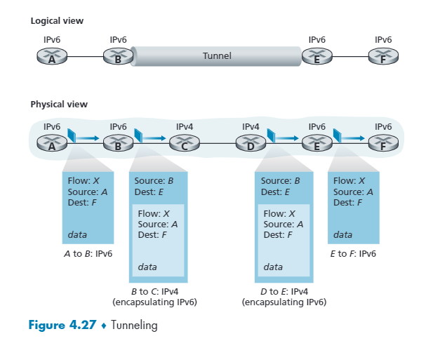

# The Network : Data Plane

## 4.1 Overview of Network Layer

### 4.1.1 Forwarding and Routing: The Data and Control Planes

網路層要做的目標很簡單，就是把資料從來源送到目的地。主要可以分為兩個部分。

- Forwarding: 指路由器從 input link 到正確 output link，通常花費時間極短，主要靠 `forwarding table` 運作。
- Routing: 計算從出發點到目的地的路徑怎麼走，會牽涉到 `routing algorithms`。

#### The Traditional Approach - Per-router Control Plane

Per-router Control Plane
每個 router 都有演算法來生出 forwarding table，比較死。

#### The SDN Approach(software-defined networking)

SDN(software-defined networking) control plane
藉由 remote controller 來幫每個 router 生產出 forwarding table，彈性比較高。

### 4.1.2 Network Service Model

一個網路模型可以做到以下幾點

- Guaranteed delivery
- Guaranteed delivery with bounded delay
- In-order packet delivery
- Guarnteed minimal bandwith
- Security

而網路層能夠做到的就是 best-effort service，也就是封包不保證能夠在時間內送到也不保證順序性，可以說 best-effort 是完全沒有提供任何服務的服務。

## 4.2 What's Inside a Router?

### 4.2.1 Input Port Processing and Destination-Based Forwarding

路由器可以分為兩個 plane，分別為 `Control plane` 以及 `Data plane`。`control plane` 的原件就是路由處理器 (routing processor)，而 `data plane` 主要有 `input/output port` 和 中間的 `switch fabric`。

- Input ports: 資料的流入口。
- Switching fabric: 將 input port 和 output port 連在一起，可以說是路由器的網路。
- Output port: 資料的流出口。
- Routing processor: 路由的處理器，在傳統的路由器，他通常會執行自己的路由演算法，在 SDN 負責和 remote controller 溝通。

#### Forwarding

Forwarding 有兩種方式
- Destination-based forwarding: 只看目的地的 ip，forwarding 的機制是透過最長前綴 (longest prefix) 的方式來判斷要往哪個 Link interface 走。
- Generalized forwarding: 還會看封包的內容來決定要怎麼走。

### 4.2.2 Switching

switching fabric 的架構有三種
- memory: copy 到記憶體，再用 cpu 處理，一次一個，速度由記憶體頻寬影響。
- bus: 由共享匯流排傳出，一樣只能一次一個，有 bus contention 的問題，比 memory 快很多。
- interconnection network: cross bar，線路不要重疊就可以，速度可以到 100 tbps。

### 4.2.3 Output Port Processing

將已經暫存的封包從 output port 推上 output link，包含排程和封包 de-queueing 的過程都在這邊。

### 4.2.4 Where Does Queueing Occur?

Input port 和 output port 都會 queueing，最後 queue 滿了則會發生 `packet loss`。

buffer 會做排程(scheduling)，若滿了就 drop 掉。drop 有分 tail drop 和 priority drop。

#### Input Queueing

若中間 switch fabric 的速度不夠快，那麼 input port 是有可能要 queueing 的，且如果某一個 input port 的封包太大，可能會造成 HOL(head of blocking) 的問題。

#### Output Queueing

補

### 4.2.5 Packet Scheduling

#### First-in-First-Out(FIFO)

一般排隊的方式，缺點是可能會有 HOL(head of blocking) 的問題。

#### Priority Queueing

替封包加上優先度，讓優先度高的先過，缺點是優先度低的封包可能會有 starving 的問題。

#### Round Robin and Weighted Fair Queueing(WFQ)

Fair queueing 是指每個封包的優先度都平等，每處理完一段時間就換下一個處理。而 Weighted fair queueing 會依據封包的內容，做隊列的分類，根據隊列的權重來取出相對應多的封包，並對每個隊列作輪流的處理。

## 4.3 The Internet Protocol(IP): IPv4, Addressing, IPv6, and More

### 4.3.1 IPv4 Datagram Format

- **Version**: 4 bit，表示版本，不同版本使用不同的 datagram。
- **Header length**: 4 bit，用來表示 ipv4 內容真正的開始位置是哪裡，因為 ipv4 datagram 可能包含一些其他的 options。
- **Type of service**: 6 bit，用來區分不同的 ipv4 datagram 服務。
- **Datagram length**: 16 bit，ipv4 datagram 的總長度。
- **Identifier, flags, fragmentation offset**: 32 bit，這三個區域負責將較大塊的 datagram 切成小的 datagram 並送到目的地後再整合送給上層，目前 ipv6 是不允許的。
- **Time to live**: 封包的存活時間，時間一到就被 drop 掉。
- **Protocol**: 8 bit，用來表示這份 datagram 對應到的傳輸層協議維和，例如 6 代表 TCP、17 代表 UDP。
- **Header checksum**: 16 bit，和 TCP、UDP 的 checksum 一樣，只是每經過一個 router，checksum 都需要被重新計算，因為 TTL 或 options 都有可能變動。
- **Source and destination IP addresses**: 32 + 32 bit，目的地和來源地 Ip。
- **Options**: 1~40 bit，通常很少被使用，因為會影響封包在路由器傳送的效率，Ipv6 不使用。
- **Data(payload)**: payload 不在 header 的範圍，傳輸層的資料，也能放其他類型的資料，例如 ICMP 訊息。

### 4.3.2 IPv4 Addressing

#### Subnet

有前半部相同的數字的 ip 網路，被稱為一個 `subnet`，而如果前面有 n 個數字是一樣的，則 `/n` 就是一個 n bits 長的 subnet mask。

#### Classful addressing

Ip 是由**字首**和**位址**組合而成，在 classful addressing 中 ip 被分為四種類別 A、B、C、D、E，而早期分的子網路遮罩只能是 `8 bit`、`16 bit` 或 `24 bit`，一般字首用 `24 bit` 位址數量會有點不夠，而 `16 bit` 的位址數量又有點太多。

#### CIDR(Classless Interdomain Routing)

用來取代 classful addressing 的方式，將 ip 分為 `a.b.c.d /x`，每一個部分 `8 bits`，並且由 `x (遮罩常度)`來定義 subnet。

#### Obtaining a block of address

藉由不斷往上一個層級做詢問來取得一段 ip。最上面的層級是由 ICANN(Internet Corporation for Assigned Names and Numbers) 來做分配，ICANN 同時也負責 DNS root server 的管理。

#### Obtaining a Host Address: The Dynamic Host Configuration Protocol (DHCP)

在取得一段 ip 後，網管人員通常會自己設定路由器的 ip 位址。而每個主機的 ip 分配是路由器透過 `DHCP(Dynamci Host Configuration Protocol)` 來自動分配的。由於 `DHCP` 的自動性，他又被稱為 `plug-and-play(隨插即用)`、`zeroconf(零設定)` 協議，有這種功能的路由器一般叫做 **IP 分享器**。

具體步驟
    
    1. 正要加入網路的用戶會先廣播訊息，詢問有沒有 DHCP 伺服器。
    2. DHCP 收到訊息後會回應一組 ip 給客戶。
    3. 客戶收到後再詢問 DHCP 伺服器是否能用。
    4. DHCP 伺服器確認後，客戶端就可以使用了。

### 4.3.3 Network Address Translation(NAT)

**NAT** 是一種將公網 IP 轉為私網 IP 的方式，其方法主要是利用 port number 的唯一性，只需要向 ISP 請求一份位址，就可以透過中間的 port number 來轉傳封包到各裝置，來避免網路的 ipv4 耗盡問題。

另外如果內部的裝置 ip 有修改，也不需要通知外界，內部可以自己調整。

另外只要 ISP 那邊收到封包內的目的地或來源地是長得像內網 ip 的，通常會被捨棄掉。

通常是路由器會實作 NAT，製作 `translation talbe`。

### 4.3.4 IPv6

IPv6 的出現是因為 IPv4 的位址耗盡，IPv6 可用的位址有 `340,282,366,920,938,463,463,374,607,431,768,211,456 ` 個。

- **Version**: 4bit，datagram 的版本，IPv6 是 6。
- **Traffic class**: 8 bit，用來辨識 datagram 的優先度。
- **Flow label**: 20 bit，給封包一個標籤，經過路由器時，路由器可以做紀錄或控管。
- **Payload length**: 16 bit，表示封包資料的長度。
- **Next header**: 8 bit，用來表示封包資料內使用的協議。
- **Hop limit**: 8 bit，類似 ipv6 的 TTL，只要 hop limit 歸零就要丟棄。
- **Source and destination addresses**: 128 bit，來源以及目的地的位址。

#### Transitioning from IPv4 to IPv6

目前大部分的裝置對 IPv6 的普及度還沒有那麼大，因此目前過度 IPv4 到 IPv6 的技術是使用 `Tunneling`，假設 IPv4 的路由器要將資料送給 IPv6，那麼在 IPv4 那端會把 IPv6 的資料放在 data body 內，送到 IPv6 路由器後再拆解，反之亦然。

## 4.4 Generalized Forwarding and SDN

在 generalized forwarding 中，路由器中 forwarding tables 統一在一個遠端 controller 生成，不過由於其內部的結構 (headers、counter、action)，其作用不再只有 forwarding，因此給他另一個名字「Flow table」。

### 4.4.1 Match

Controller 回傳的 flow table 總共有三個欄位，分別為 headers、counter 以及 action，在 match 這個步驟中，會判斷封包符合哪一個 header 的欄位，並且做出相對應的 action。

### 4.4.2 Action

Action 中有幾種方式
- Forwarding: 將資料 forward 到特定 interface。
- Dropping: 丟棄封包。
- Modify: 修改封包內的某個欄位。

## 4.5 Middleboxes
