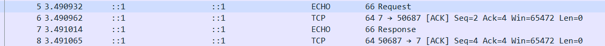
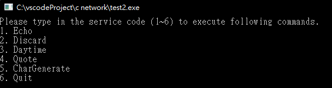
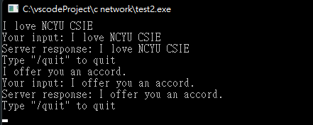
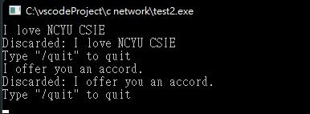
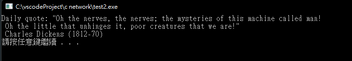
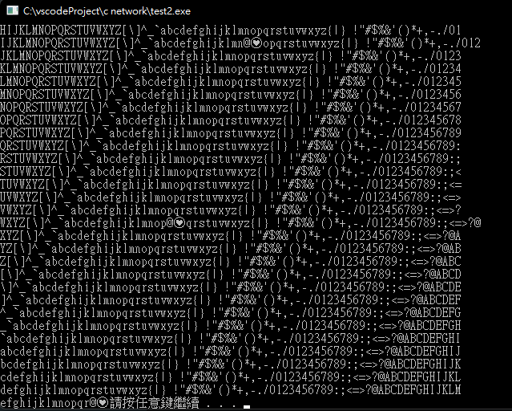

# 網路程式作業 HW3

## 1. 使用wireshark抓封包

### Connection Establishment


### Send / Recv



### Connection Close


## 2. 5種服務的示範程式

```c++
#include <iostream>
#include <winsock.h>
using namespace std;

const int MESSAGE_SIZE = 1024;
const int MAX_LINE = 1024;


class ServiceModel {
    private:
        SOCKET sokt;
        sockaddr_in service;
        WSADATA wsaData; 

        enum PortNumber {
            ECHO = 7,
            DISCARD = 9,
            DAYTIME = 13,
            QUOTE = 17,
            CHARGEN = 19
        };

        void initSocket() {
            this->close();
            sokt = SOCKET();
            WSAStartup(0x101, (LPWSADATA)&wsaData);
            sokt = socket(AF_INET, SOCK_STREAM, 0);
            service.sin_family = AF_INET;
        }

        void connectToIp(string ip, int port) {
            initSocket();
            service.sin_addr.s_addr = inet_addr(ip.c_str());
            service.sin_port = htons(port);
            connect(sokt, (LPSOCKADDR) &service, sizeof(service));
        }

        void sendData(string message) {
            send(sokt, message.c_str(), strlen(message.c_str()) + 1, 0);
        }

        string recvData() {
            char recvCString[MESSAGE_SIZE];
            int n = recv(sokt, recvCString, MAX_LINE, 0);
            string recvString = string(recvCString);
            return recvString;
        }

        void close() {
            closesocket(sokt);
        }

        void echo() {
            this->connectToIp("127.0.0.1", PortNumber::ECHO);
            cin.get();
            string input;
            while(getline(cin, input)) {
                if(input == "/quit") {
                    break;
                }
                cout << "Your input: " << input << endl;
                this->sendData(input);
                string recvd = this->recvData();
                cout << "Server response: " << recvd << endl;
                cout << "Type \"/quit\" to quit" << endl;
            }
            
            this->close();
            
        }

        void discard() {
            this->connectToIp("127.0.0.1", PortNumber::DISCARD);
            cin.get();
            string input;
            while(getline(cin, input)) {
                if(input == "/quit") {
                    break;
                }
                this->sendData(input);
                cout << "Discarded: " << input << endl;
                cout << "Type \"/quit\" to quit" << endl;
            }
            
            this->close();
        }

        void dayTime() {
            this->connectToIp("127.0.0.1", PortNumber::DAYTIME);
            string currentTime = this->recvData();
            cout << "Current time: " << currentTime << endl;
            system("pause");
        }

        void quote() {
            this->connectToIp("127.0.0.1", PortNumber::QUOTE);
            string dailyQuote = this->recvData();
            cout << "Daily quote: " << dailyQuote << endl;
            system("pause");
        }

        void charGenetate() {
            this->connectToIp("127.0.0.1", PortNumber::CHARGEN);
            string recvData = "";
            int bufferCnt = 5;
            while(bufferCnt--) {
                cout << this->recvData();
            }
            this->close();
            system("pause");
        }

        ServiceModel() {
            initSocket();
        }

        ~ServiceModel() {
            WSACleanup();
        }
    public:

        static ServiceModel* getInstance() {
            static ServiceModel singleton;
            return &singleton;
        }

        void displayMenu() {
            cout << "Please type in the service code (1~6) to execute following commands." << endl;
            cout << "1. Echo" << endl;
            cout << "2. Discard" << endl;
            cout << "3. Daytime" << endl;
            cout << "4. Quote" << endl;
            cout << "5. CharGenerate" << endl;
            cout << "6. Quit" << endl;
        }

        void executeCommand(int cmd) {
            system("cls");
            switch(cmd) {
                case 1:
                    echo();
                    break;
                case 2:
                    discard();
                    break;
                case 3:
                    dayTime();
                    break;
                case 4:
                    quote();
                    break;
                case 5:
                    charGenetate();
                    break;
                default:
                    break;
            }
            system("cls");
        }

};

int main() {
    
    // 執行環境有編碼問題，無法使用中文，所以全部用英文。
    // 來看看 over-engineered code 長怎樣。
    ServiceModel* serviceModel = ServiceModel::getInstance();
    string input;
    do {
        serviceModel->displayMenu();
        cin >> input;
        serviceModel->executeCommand(stoi(input)); // it might break the program easily
    } while(input != "6");
    system("pause");
    return 0;
}
```








## 3. 本週心得

好玩，終於有寫程式的感覺了，call API 的能力是每個開發者都要會的能力，這項作業就是在練習這項技術，未來如果走網頁，前後端 API 滿像這個概念的(只是沒有那麼底層)。