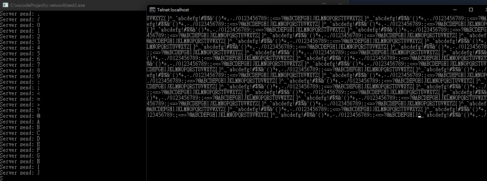
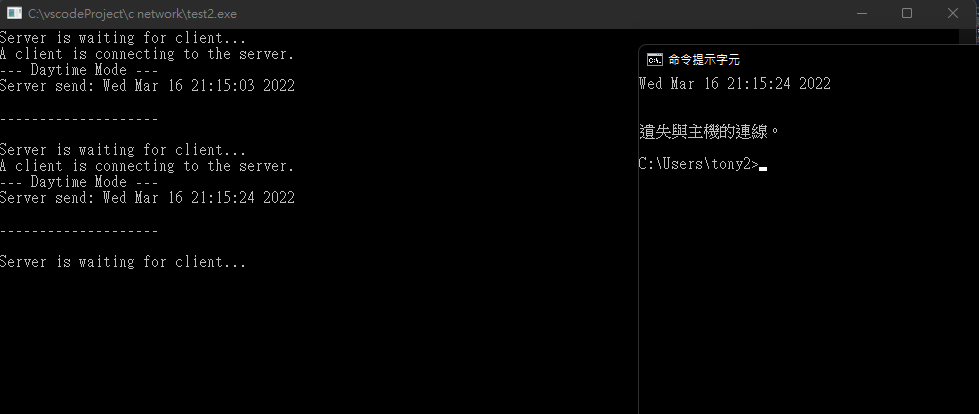
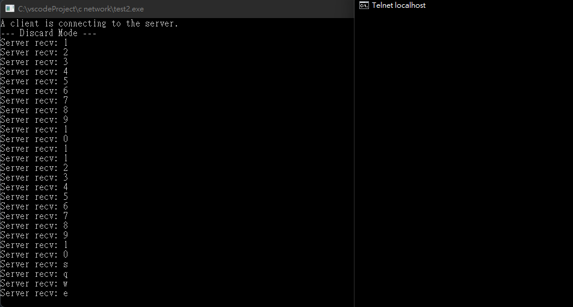
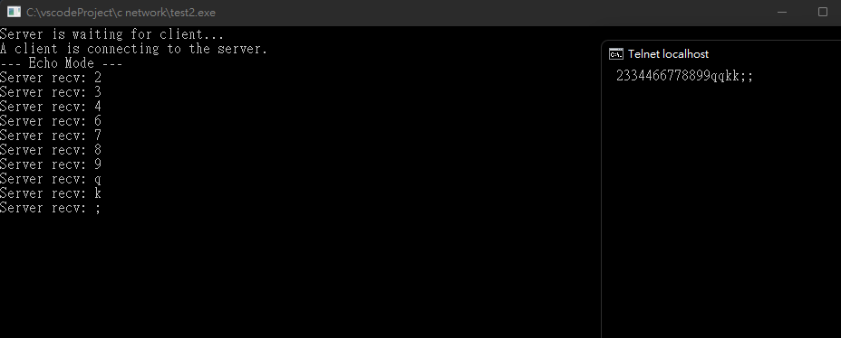
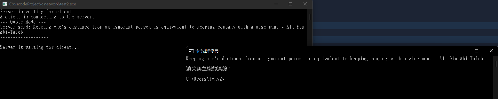

# 網路程式作業 HW4: 實作Simple TCP/IP Server

## 程式碼
順便複習設計模式常用的模式，`strategy pattern`、`singleton pattern`

```c++
// compile command: g++ $fileName -std=c++17 -l ws2_32 -o $fileNameWithoutExt && start $fileNameWithoutExt.exe
#include <iostream>
#include <vector>
#include <ctime>
#include <winsock.h>
using namespace std;

const int MESSAGE_SIZE = 1024;
const int MAX_LINE = 1024;

// 包裝後的 tcpip send recv 的函式，不知道放哪裡所以丟在一個 static class
class TCP_HelperFunction {
    private:
        TCP_HelperFunction() {

        }
    public:
        static void sendData(SOCKET& socket, string message) {
            int n = send(socket, message.c_str(), strlen(message.c_str()) + 1, 0);
            if(n == -1) {
                throw "[Error] Unable to send data, the target socket is disconnected.";
            }
        }
        static string recvData(SOCKET& socket) {
            char recvCString[MESSAGE_SIZE];
            int n = recv(socket, recvCString, MAX_LINE, 0);
            if(n == 0) {
                throw "[Error] Unable to receive the data from the socket, the target socket is disconnected.";
            }
            string recvString = string(recvCString);
            return recvString;
        }
};

// design pattern - 策略模式練習
// 把 handleClient 的 algorithm 抽離成一個類

class StrategyInterface {
    public:
        virtual void handleClient(SOCKET& clientSocket) = 0;
};

class DiscardStrategy : public StrategyInterface {
    public:
        void handleClient(SOCKET& clientSocket) override {
            string data;
            cout << "--- Discard Mode ---" << endl;
            while(true) {
                try {
                    data = TCP_HelperFunction::recvData(clientSocket);
                    cout << "Server recv: " << data << endl;
                } catch(const char* error) {
                    string errorMessage = string(error);
                    cout << errorMessage << endl;
                    break;
                }
            }
            cout << "--------------------" << endl << endl;
        }
};

class EchoStrategy : public StrategyInterface {
    public:
        void handleClient(SOCKET& clientSocket) override {
            string data;
            cout << "--- Echo Mode ---" << endl;
            TCP_HelperFunction::recvData(clientSocket);
            while(true) {
                try {
                    data = TCP_HelperFunction::recvData(clientSocket);
                    cout << "Server recv: " << data << endl;
                    TCP_HelperFunction::sendData(clientSocket, data);
                } catch(const char* error) {
                    string errorMessage = string(error);
                    cout << errorMessage << endl;
                    break;
                }
            }
            cout << "-----------------" << endl << endl;
        }
};

class DaytimeStrategy : public StrategyInterface {
    public:
        void handleClient(SOCKET& clientSocket) override {
            string data;
            cout << "--- Daytime Mode ---" << endl;
            try {
                time_t now = time(0);
                tm* localtm = localtime(&now);
                data = string(asctime(localtm));
                TCP_HelperFunction::sendData(clientSocket, data);
                cout << "Server send: " + data << endl;
            } catch(const char* error) {
                string errorMessage = string(error);
                cout << errorMessage << endl;
            }
            cout << "--------------------" << endl << endl;
        }
};

class QuoteStrategy : public StrategyInterface {
    private:
        vector<string> quotes = {
            "He who is not contented with what he has, would not be contented with what he would like to have. - Socrates",
            "Keeping one's distance from an ignorant person is equivalent to keeping company with a wise man. - Ali Bin Abi-Taleb",
            "Creativity is allowing yourself to make mistakes. Art is knowing which ones to keep. - Scott Adams",
            "If you have always done it that way, it is probably wrong. - Charles F. Kettering, 1876 - 1958",
            "Your visions will become clear only when you can look into your own heart. Who looks outside, dreams; who looks inside, awakens. - C.G. Jung"
        };
    public:
        void handleClient(SOCKET& clientSocket) override {
            string data;
            cout << "--- Quote Mode ---" << endl;
            srand(time(NULL));
            int quotesSize = quotes.size();
            try {
                string quote = quotes[rand() % quotesSize];
                TCP_HelperFunction::sendData(clientSocket, quote);
                cout << "Server send: " << quote << endl;
            } catch(const char* error) {
                string errorMessage = string(error);
                cout << errorMessage << endl;
            }
            cout << "-------------------" << endl << endl;

        }
};

class CharacterGenerateStrategy : public StrategyInterface {
    public:
        void handleClient(SOCKET& clientSocket) override {
            string data;
            cout << "--- Character Generate Mode ---" << endl;
            string s = "!#$%&'()*+,-./0123456789:;<=>?@ABCDEFGHIJKLMNOPQRSTUVWXYZ[]^_`abcdefg";
            int i = 0;
            while(true) {
                try {
                    string data = "";
                    data += s[i];
                    TCP_HelperFunction::sendData(clientSocket, data);
                    cout << "Server send: " << data << endl;
                    i = (i + 1) % s.size();
                } catch(const char* error) {
                    string errorMessage = string(error);
                    cout << errorMessage << endl;
                    break;
                }
            }
            cout << "-------------------------------" << endl << endl;
        }
};


// design pattern - 單例模式練習
// server 只有一個，所以把建構子私有化，用 static 的方式在需要時才生成
// 又稱 lazy initialization
class Server {
    private:
        SOCKET sokt; 
        sockaddr_in service;
        WSADATA wsaData;
        StrategyInterface* strategy;

        void initSocket() {
            sokt = SOCKET();
            WSAStartup(0x101, (LPWSADATA)&wsaData);
            sokt = socket(AF_INET, SOCK_STREAM, 0);
            service.sin_family = AF_INET;
            service.sin_port = htons(1234);
            service.sin_addr.s_addr = inet_addr("127.0.0.1");
            bind(sokt, (struct sockaddr *) &service, sizeof(service));
        }

        void close() {
            closesocket(sokt);
        }

        Server() {
            this->setStrategy(new EchoStrategy()); // default to echo mode
            initSocket();
        }

        ~Server() {
            delete strategy;
            close();
        }
    protected:
        void handleClient(SOCKET& clientSocket) {

        }
    public:
        static Server* getInstance() {
            static Server singleton;
            return &singleton;
        }

        void setStrategy(StrategyInterface* strategy) {
            delete this->strategy;
            this->strategy = strategy;
        }

        void run() {
            listen(sokt, 3);

            while(true) {
                sockaddr_in clientAddress;
                int clientAddressSize = sizeof(clientAddress);
                cout << "Server is waiting for client..." << endl;
                SOCKET clientSocket = accept(sokt, (struct sockaddr *)&clientAddress, &clientAddressSize);
                cout << "A client is connecting to the server." << endl;
                this->strategy->handleClient(clientSocket);
                closesocket(clientSocket);
            }
        }
};

int main() {
    Server* server = Server::getInstance();
    server->setStrategy(new DaytimeStrategy()); // 藉由使用不同的策略來替換功能
    server->run();
    system("pause");
    return 0;
}
```

## 圖片

### chargen


### daytime


### discard


### echo


### quote
