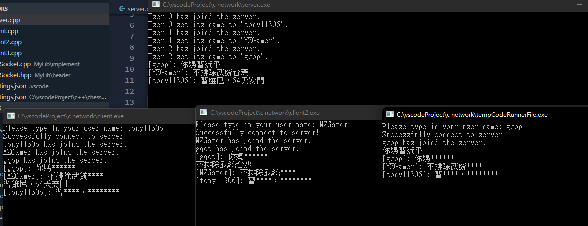
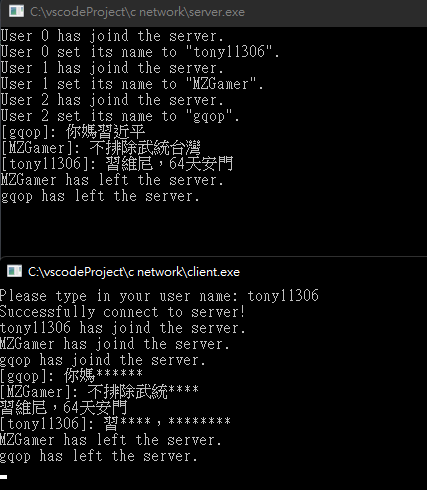

# 網路程式作業 HW6

## 三人以上聊天 + 屏蔽 + 使用者名稱 + thread

---


## 程式碼

### Server.cpp
```c++
#include <iostream>
#include <thread>
#include <set>
#include <vector>
#include "MySocket.hpp"
// compile command:
// g++ $fileName -std=c++17 -I MyLib/header/ -g MyLib/implement/*.cpp -o $fileNameWithoutExt -l ws2_32
using namespace std;

set<Socket*> clients;
int id = 0;
vector<string> banWords = {
    "台灣",
    "西藏",
    "新疆",
    "獨立",
    "自由",
    "習近平",
    "64",
    "六四",
    "天安門",
    "維尼"
};

void broadcast(string message) {
    for(Socket* client : clients) {
        client->sendData(message);
    }
}

void replaceBadWords(string& message) {
    for(string& banWord : banWords) {
        size_t pos = 0;
        string replaceString = "";
        for(int i = 0; i < banWord.size(); ++i) {
            replaceString += "*";
        }
        while((pos = message.find(banWord)) != string::npos) {
            message.replace(pos, banWord.size(), replaceString);
        }
        
    }
}

void handleClient(Socket* client) {
    int userID = id++;
    string userName = "";
    try {
        cout << "User " << userID << " has joind the server." << endl;
        userName = client->recvData();
        cout << "User " << userID << " set its name to \"" << userName << "\"." << endl;
        broadcast(userName + " has joind the server.");
        while(true) {
            string message = client->recvData();
            message = "[" + userName + "]: " + message;
            cout << message << endl;
            replaceBadWords(message);
            broadcast(message);
        }
    } catch(const char* err) {
        clients.erase(client);

        if(userName == "") {
            cout << "User " << userID;
        } else {
            cout << userName;
            broadcast(userName + " has left the server.");
        }
        cout << " has left the server." << endl;
        
        delete client;
    }
    
}

int main() {
    Socket server;
    server.bindTo("127.0.0.1", 7777);
    server.listenConnections(5);

    while(true) {
        Socket* client = new Socket(server.acceptClient());
        clients.insert(client);
        thread clientThread(handleClient, client);
        clientThread.detach();
    }
    WSACleanup();
    system("pause");
    return 0;
}
```

### Client.cpp
```c++
#include "MySocket.hpp"
#include <thread>
using namespace std;

string userName;

void listenFromServer(Socket* mySocket) {
    while(true) {
        try {
            string s = mySocket->recvData();
            cout << s << endl;
        } catch(const char* err) {
            cout << err << endl;
            break;
        }
    }
}

void initUserName() {
    cout << "Please type in your user name: ";
    cin >> userName;
    cin.get();
}

void input(Socket* mySocket) {
    mySocket->sendData(userName);
    while(true) {
        string data;
        getline(cin, data);
        mySocket->sendData(data);
    }
}


int main() {
    Socket mySocket;
    initUserName();
    mySocket.connectTo("127.0.0.1", 7777);
    cout << "Successfully connect to server!" << endl;
    thread t(listenFromServer, &mySocket);
    thread t2(input, &mySocket);
    t.join();
    WSACleanup();
    return 0;
}
```

### MySocket.hpp
```c++
#ifndef MYSOCKET_H
#define MYSOCKET_H
#include <winsock.h>
#include <iostream>
class Socket {
    private:
        SOCKET sokt;
        WSADATA wsaData;
        sockaddr_in service;
        static const int MESSAGE_SIZE = 1024;
        static const int MAX_LINE = 1024;
    public:
        Socket();
        Socket(SOCKET sokt);
        ~Socket();
        void bindTo(std::string address, int port);
        void listenConnections(int limit);
        Socket acceptClient();
        void connectTo(std::string address, int port);
        void sendData(std::string data);
        std::string recvData();
        void close();
};

#endif
```

### MySocket.cpp
```c++
#include <winsock.h>
#include <iostream>
#include "MySocket.hpp"

Socket::Socket() {
    service.sin_family = AF_INET;
    WSAStartup(0x101, (LPWSADATA)&wsaData);
    sokt = SOCKET();
    sokt = socket(AF_INET, SOCK_STREAM, 0);
}

Socket::~Socket() {
    closesocket(sokt);
}

Socket::Socket(SOCKET sokt) {
    this->sokt = sokt;
}

void Socket::bindTo(std::string address, int port) {
    service.sin_port = htons(port);
    service.sin_family = AF_INET;
    service.sin_addr.s_addr = inet_addr(address.c_str());
    if(bind(sokt, (LPSOCKADDR)&service, sizeof(service)) < 0) {
        throw "[Error] Unable to bind to this address";
    }
}

void Socket::listenConnections(int limit) {
    listen(sokt, limit);
}

Socket Socket::acceptClient() {
    sockaddr_in clientAddress;
    int clientAddressSize = sizeof(clientAddress);
    SOCKET clientSokt = accept(sokt, (struct sockaddr *)&clientAddress, &clientAddressSize);
    Socket  clientSocket = Socket(clientSokt);

    return clientSocket;
}

void Socket::connectTo(std::string address, int port) {
    service.sin_addr.s_addr = inet_addr(address.c_str());
    service.sin_port = htons(port);
    if(connect(sokt, (LPSOCKADDR) &service, sizeof(service)) == SOCKET_ERROR) {
        throw "[Error] Unable to connect to server.";
    }
}

void Socket::sendData(std::string data) {
    int n = send(sokt, data.c_str(), strlen(data.c_str()) + 1, 0);
    if(n == -1) {
        throw "[Error] Unable to send data, the target socket is disconnected.";
    }
}

std::string Socket::recvData() {
    char recvCString[MESSAGE_SIZE];
    int n = recv(sokt, recvCString, MAX_LINE, 0);
    if(n == 0) {
        throw "[Error] Unable to receive the data from the socket, the target socket is disconnected.";
    }
    std::string recvString = std::string(recvCString);
    if(recvString.size() == 0) {
        throw "[Error] Unable to receive the data from the socket, the target socket is disconnected.";
    }
    return recvString;
}

std::string getHostByAddress(std::string address) {
    in_addr sAddr;
    sAddr.s_addr = inet_addr(address.c_str());
    hostent* hostContent = gethostbyaddr((LPSTR) &sAddr, sizeof(sAddr), AF_INET);
    return hostContent != nullptr ? hostContent->h_name : "";
}

void Socket::close() {
    closesocket(sokt);
}
```

## 心得

程式好玩，以前有寫過類似的，所以滿簡單的。影片還沒看。