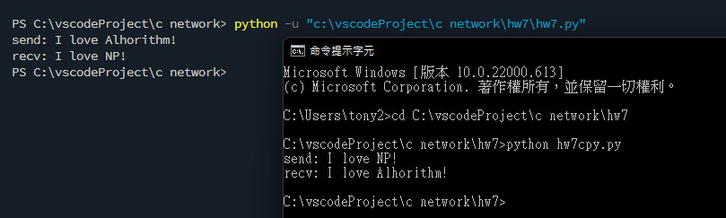
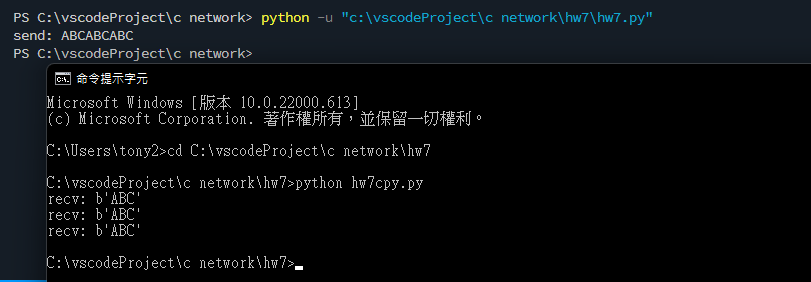
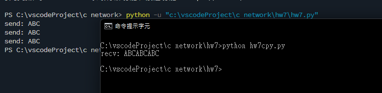
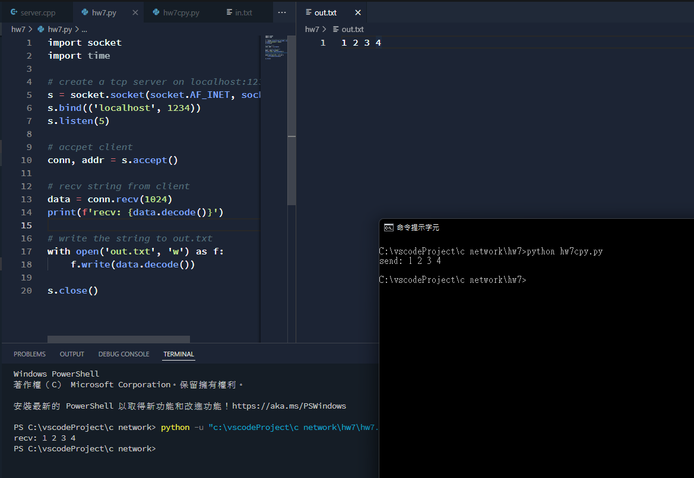
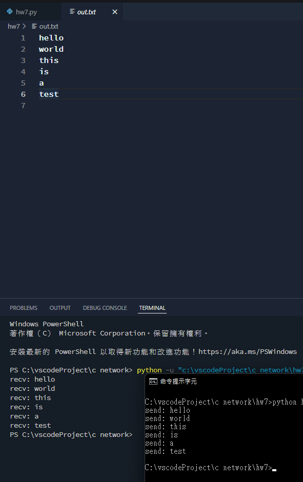
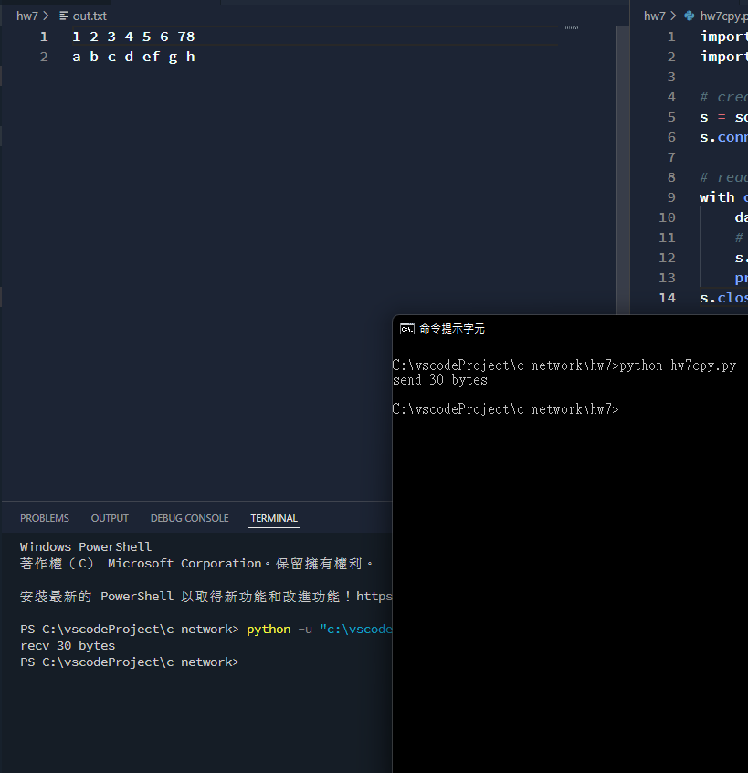
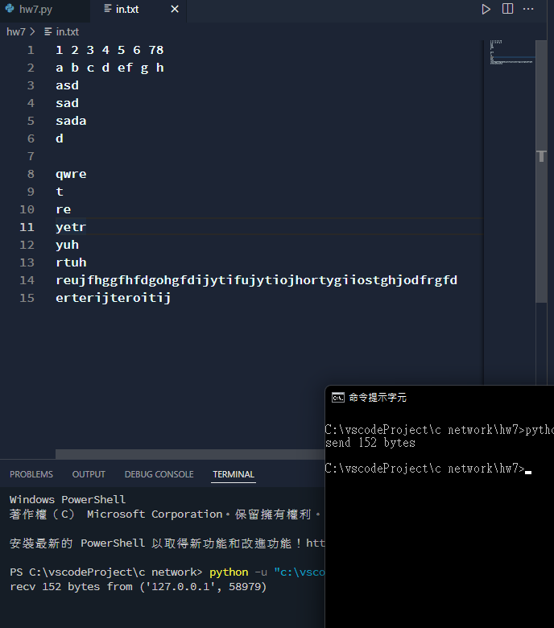
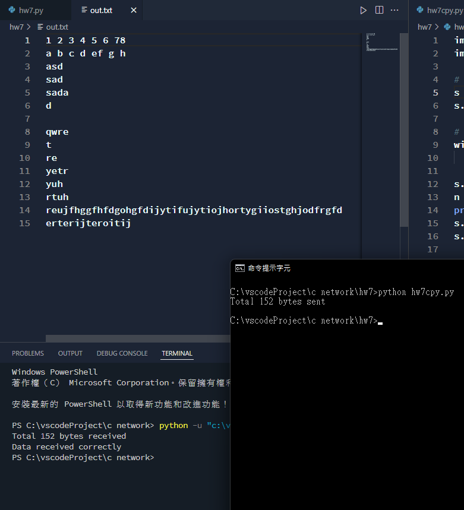
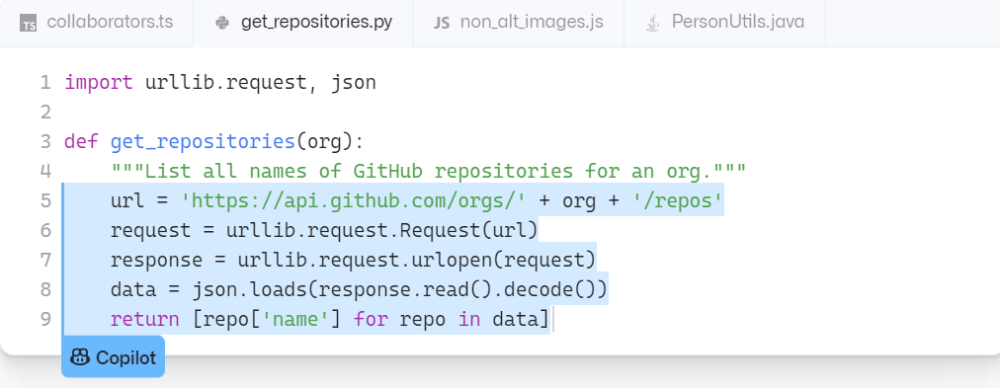

## 練習1：請寫一組程式來測試：

> 若兩方都先送後收，可以運作嗎？



#### server
```py
import socket

# create a localhost socket and bind it to port 1234
s = socket.socket(socket.AF_INET, socket.SOCK_STREAM)
s.bind(('', 1234))
s.listen(1)

# accept a connection
conn, addr = s.accept()

# send a string 'I love Alhorithm!' to client
msg = 'I love Alhorithm!'
conn.send(msg.encode())
print(f'send: {msg}')
# recv a string from client
data = conn.recv(1024)
print(f'recv: {data.decode()}')
```

#### client
```py
import socket

# create a socket and connect to localhost:1234
s = socket.socket(socket.AF_INET, socket.SOCK_STREAM)
s.connect(('localhost', 1234))

# send a string 'I love NP!' to server
msg = 'I love NP!'
s.send(msg.encode())
print(f'send: {msg}')
# recv a string from server
data = s.recv(1024)
print(f'recv: {data.decode()}')
```

> 若兩方都先收後送，可以運作嗎？

當然不行，recv 是 blocking 特性的，兩邊都在等意味著兩邊都是 blocking。

## 練習2：

> 完成「送一次，收多次」的實驗



#### server
```py
import socket

# create a localhost socket and bind it to port 1234
s = socket.socket(socket.AF_INET, socket.SOCK_STREAM)
s.bind(('', 1234))
s.listen(1)

# accept a connection
conn, addr = s.accept()

# send a string 'ABCABCABC' to client
msg = 'ABCABCABC'
conn.send(msg.encode())
print(f'send: {msg}')
conn.close()
```

#### client
```py
import socket

# create a socket and connect to localhost:1234
s = socket.socket(socket.AF_INET, socket.SOCK_STREAM)
s.connect(('localhost', 1234))

# keep recv 3 bytes data each time
while True:
    data = s.recv(3)
    if data:
        print(f'recv: {data}')
    else:
        break
```

> 完成「送多次，收一次」的實驗



#### server
```py
import socket

# create a localhost socket and bind it to port 1234
s = socket.socket(socket.AF_INET, socket.SOCK_STREAM)
s.bind(('', 1234))
s.listen(1)

# accept a connection
conn, addr = s.accept()

# send a string 'ABCABCABC' to client
msg = 'ABC'
conn.send(msg.encode())
print(f'send: {msg}')
conn.send(msg.encode())
print(f'send: {msg}')
conn.send(msg.encode())
print(f'send: {msg}')
conn.close()
```

#### client
```py
import socket
import time

# create a socket and connect to localhost:1234
s = socket.socket(socket.AF_INET, socket.SOCK_STREAM)
s.connect(('localhost', 1234))

# sleep for 0.1 seconds
time.sleep(0.1)

# recv a 9 bytes string from server
msg = s.recv(9)
print(f'recv: {msg.decode()}')
```

## 練習3
> 完成UDP成對收送的實驗
#### server
```py
import socket
import time

# create a udp socket server and bind to localhost:1234
s = socket.socket(socket.AF_INET, socket.SOCK_DGRAM)
s.bind(('localhost', 1234))

# keep recv data from client
while True:
    # recv data from client
    data, addr = s.recvfrom(6)
    print(f'recv: {data.decode()}')
    # sleep for 1 sec
    time.sleep(1)

s.close()
```

#### client

```py
import socket
import time

# connect to a udp server localhost:1234
s = socket.socket(socket.AF_INET, socket.SOCK_DGRAM)
s.connect(('localhost', 1234))

# send '[NCYU]' 5 times to server
for i in range(5):
    s.send(b'[NCYU]')
    print(f'send: [NCYU]')
```

## 練習4

> 完成單次傳送文字檔的實驗



#### server
```py
import socket
import time

# create a tcp server on localhost:1234
s = socket.socket(socket.AF_INET, socket.SOCK_STREAM)
s.bind(('localhost', 1234))
s.listen(5)

# accpet client
conn, addr = s.accept()

# recv string from client
data = conn.recv(1024)
print(f'recv: {data.decode()}')

# write the string to out.txt
with open('out.txt', 'w') as f:
    f.write(data.decode())

s.close()
```

#### client

```py
import socket
import time

# create tcp socket and connect to localhost:1234
s = socket.socket(socket.AF_INET, socket.SOCK_STREAM)
s.connect(('localhost', 1234))

# load in.txt and send to server
with open('in.txt', 'r') as f:
    data = f.read()
    s.send(data.encode())
    print(f'send: {data}')

s.close()
```

## 練習5

> 完成連續傳送大量文字檔的實驗



#### server
```py
import socket
import time

# create a tcp server on localhost:1234
s = socket.socket(socket.AF_INET, socket.SOCK_STREAM)
s.bind(('localhost', 1234))
s.listen(5)

# accpet client
conn, addr = s.accept()

# append data to out.txt
# keep recv datas
with open('hw7/out.txt', 'a') as f:
    while True:
        data = conn.recv(1024)
        if not data:
            break
        print('recv:', data.decode())
        f.write(data.decode() + '\n')

s.close()
```

#### client

```py
import socket
import time

# create tcp socket and connect to localhost:1234
s = socket.socket(socket.AF_INET, socket.SOCK_STREAM)
s.connect(('localhost', 1234))

datas = ['hello', 'world', 'this', 'is', 'a', 'test']
# send these datas to server
for data in datas:
    s.send(data.encode())
    print('send:', data)
    time.sleep(0.1)

s.close()
```

## 練習6

> 完成連續傳送大量二位元檔的實驗



#### server

```py
import socket
import time

# create a tcp server on localhost:1234
s = socket.socket(socket.AF_INET, socket.SOCK_STREAM)
s.bind(('localhost', 1234))
s.listen(5)

# accpet client
conn, addr = s.accept()

datas = b''
# keep recv data from client
while True:
    data = conn.recv(1024)
    if not data:
        break
    datas += data

# print how many bytes of data
print(f'recv {len(datas)} bytes')
# write data as binary to out.txt
with open('hw7/out.txt', 'wb') as f:
    f.write(datas)
    
```

#### client

```py
import socket
import time

# create tcp socket and connect to localhost:1234
s = socket.socket(socket.AF_INET, socket.SOCK_STREAM)
s.connect(('localhost', 1234))

# read in.txt as binary data
with open('in.txt', 'rb') as f:
    data = f.read()
    # send data
    s.send(data)
    print(f'send {len(data)} bytes')
s.close()
```

## 練習7

> 請完成UDP傳檔的實驗



#### server
```py
import socket
import time

# create udp socket and bind to localhost:1234
s = socket.socket(socket.AF_INET, socket.SOCK_DGRAM)
s.bind(('localhost', 1234))

datas = b''
# keep recv data
while True:
    data, addr = s.recvfrom(1024)
    print(f'recv {len(data)} bytes from {addr}')
    datas += data
    # write data to out.txt
    with open('out.txt', 'wb') as f:
        f.write(data)
    time.sleep(1) 
```

#### client

```py
import socket
import time

# connect to udp server localhost:1234
s = socket.socket(socket.AF_INET, socket.SOCK_DGRAM)
s.connect(('localhost', 1234))

# read data from in.txt
with open('in.txt', 'rb') as f:
    data = f.read()

    # send data to udp server
    s.send(data)
    print(f'send {len(data)} bytes')

s.close()
```

## 練習8

> 請完成UDP傳檔改良的實驗



#### server
```py
import socket
import time

# create udp socket and bind to localhost:1234
s = socket.socket(socket.AF_INET, socket.SOCK_DGRAM)
s.bind(('localhost', 1234))

datas = b''
# keep recv data
while True:
    data, addr = s.recvfrom(1024)
    if addr != ('127.0.0.1', 5678):
        continue

    if data == b'END':
        print(f'Total {len(datas)} bytes received')
        n = int(s.recv(1024))
        if n == len(datas):
            print('Data received correctly')
            with open('hw7/out.txt', 'wb') as f:
                f.write(datas)
        else:
            print('Data received incorrectly')
        break

    datas += data
```

#### client

```py
import socket
import time

# connect to udp server localhost:1234
s = socket.socket(socket.AF_INET, socket.SOCK_DGRAM)
s.bind(('localhost', 5678))
s.connect(('localhost', 1234))

# read data from in.txt
with open('in.txt', 'rb') as f:
    data = f.read()


# send data to udp server
s.send(data)
n = str(len(data))
print(f'Total {n} bytes sent')
s.send('END'.encode())
s.send(str(n).encode())

s.close()
```

## 心得

可以用 python 就輕鬆多了，總算不用煩惱字串的東西，要傳物件還可以用 pickle 來序列化和反序列化。另外說個有趣的玩意，其實這次作業的程式碼我大概只寫了 3 成，剩下都是 AI 幫我生成的，這東西叫 [Github Copilot](https://copilot.github.com/)，基本上我註解只要寫得夠清楚，一些簡單的程式碼片段他都能生成。

特別是 networking programming 或者爬蟲，有一些比較瑣碎的程式碼就不用記太多，對於開發者來說是一大福音，甚至他還能根據程式上下文來推斷你可能要寫什麼。

~~其實我期中考也有用喔 hehe~~

