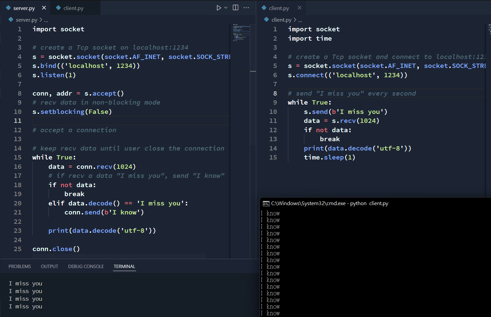
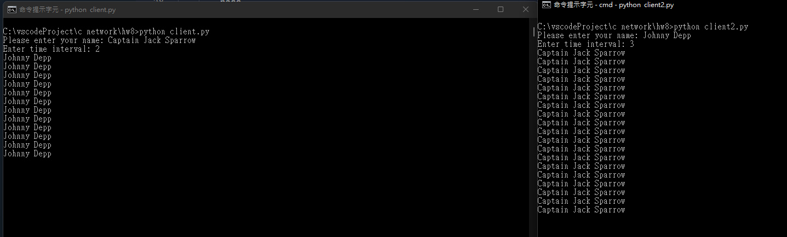
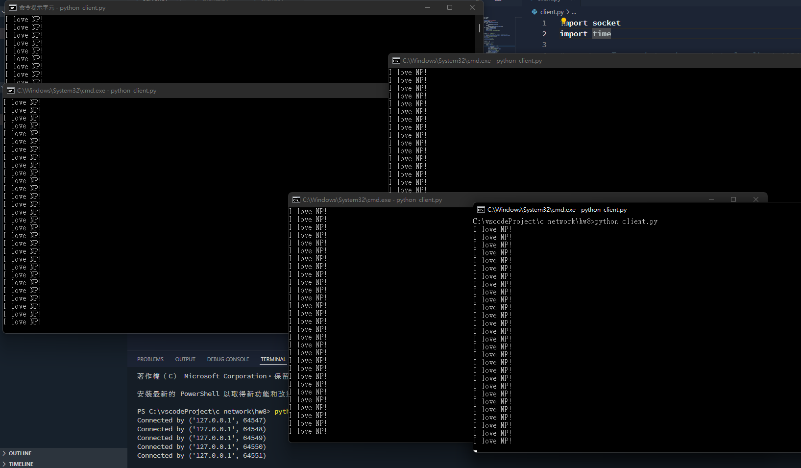

# 作業 8

## 應用1：聊天室第1版解除一人一句限制



### server

```py
import socket

# create a Tcp socket on localhost:1234
s = socket.socket(socket.AF_INET, socket.SOCK_STREAM)
s.bind(('localhost', 1234))
s.listen(1)

# accept a connection
conn, addr = s.accept()
# recv data in non-blocking mode
s.setblocking(False)


# keep recv data until user close the connection
while True:
    data = conn.recv(1024)
    # if recv a data "I miss you", send "I know"
    if not data:
        break
    elif data.decode() == 'I miss you':
        conn.send(b'I know')
    
    print(data.decode('utf-8'))

conn.close()
```

### client

```py
import socket
import time

# create a Tcp socket and connect to localhost:1234
s = socket.socket(socket.AF_INET, socket.SOCK_STREAM)
s.connect(('localhost', 1234))

# send "I miss you" every second
while True:
    s.send(b'I miss you')
    data = s.recv(1024)
    if not data:
        break
    print(data.decode('utf-8'))
    time.sleep(1)
```

## 應用2: 聊天室第2版解除一人一句限制



### server

```py
import socket

# create an Tcp socket on localhost:1234
s = socket.socket(socket.AF_INET, socket.SOCK_STREAM)
s.bind(('localhost', 1234))
s.listen(2)

# accept client 1
c1, addr1 = s.accept()
c1.setblocking(False)
# accept client 2
c2, addr2 = s.accept()
c2.setblocking(False)

# keep recv and send data
while True:
    try:
        # recv data from client 1
        data1 = c1.recv(1024)
        if data1 == b'':
            break
        # send data to client 2
        c2.send(data1)
    except BlockingIOError:
        pass
    try:
        # recv data from client 2
        data2 = c2.recv(1024)
        if data2 == b'':
            break
        # send data to client 1
        c1.send(data2)
    except BlockingIOError:
        pass

c1.close()
c2.close()
s.close()
```

### client
```py
import socket
import time

name = input('Please enter your name: ')
time_interval = int(input('Enter time interval: '))

# create a Tcp socket and connect to localhost:1234
s = socket.socket(socket.AF_INET, socket.SOCK_STREAM)
s.connect(('localhost', 1234))

# disable blocking
s.setblocking(False)

timer = time_interval
# run forever
while True:
    try:
        data = s.recv(1024)
        if data == b'':
            break
        # print data
        print(data.decode())
    except BlockingIOError:
        pass
    
    if timer > 0:
        timer -= 0.1
        time.sleep(0.1)
        continue
    # send data
    s.send(name.encode())
    # recv data
    timer = time_interval
```

## 應用3:



### server
```py
import socket
import time

def broadcast(msg, clients):
    remove_conns = []
    for i in range(len(clients)):
        try:
            clients[i].send(msg)
        except:
            remove_conns.append(clients[i])
    for conn in remove_conns:
        clients.remove(conn)
        conn.close()
        print('Client disconnected')
        

if __name__ == '__main__':
    # create a Tcp socket and bind to localhost:1234
    s = socket.socket(socket.AF_INET, socket.SOCK_STREAM)
    s.bind(('localhost', 1234))
    s.listen(5)
    # disable blocking
    s.setblocking(False)

    clients = []
    # keep accept client
    while True:
        time.sleep(0.1)
        # broadcast 'I love NP!' to all clients
        broadcast('I love NP!'.encode(), clients)
        try:
            if len(clients) >= 5:
                continue
            conn, addr = s.accept()
            print('Connected by', addr)
            # disable blocking
            conn.setblocking(False)
            clients.append(conn)
        except BlockingIOError:
            pass

```

### client
```py
import socket
import time

# create a Tcp socket and connect to localhost:1234
s = socket.socket(socket.AF_INET, socket.SOCK_STREAM)
s.connect(('localhost', 1234))

# keep recv data
while True:
    data = s.recv(1024)
    if data == b'':
        break
    # print data
    print(data.decode())
```

## 心得

Python 讓生活更便利，Github Copilot 你值得擁有。