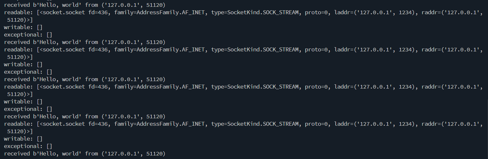
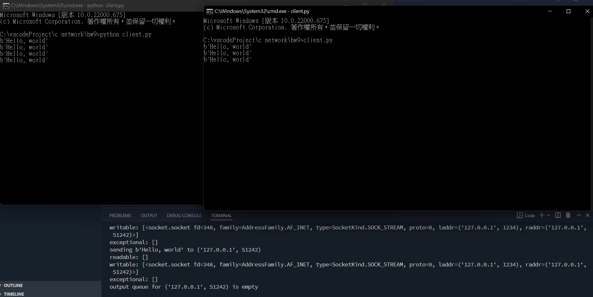
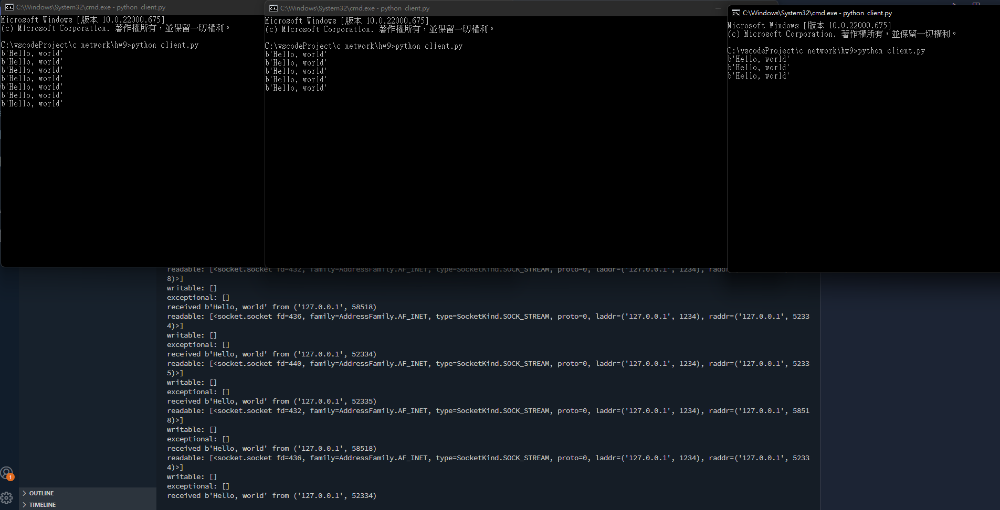
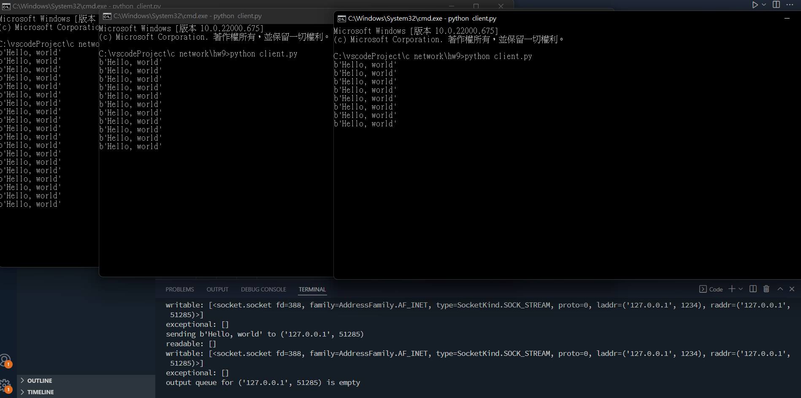
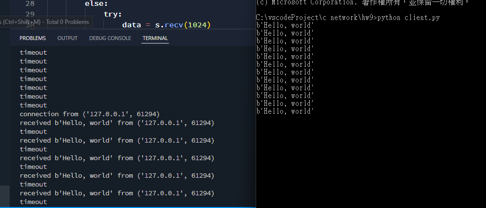

# 網路程式設計 HW9

## 練習1：一送一收，觀察檢查表的運作



### server

```py
import socket
from select import select

# create an server on localhost:1234
server = socket.socket(socket.AF_INET, socket.SOCK_STREAM)
server.setsockopt(socket.SOL_SOCKET, socket.SO_REUSEADDR, 1)
server.bind(('localhost', 1234))
server.listen(5)

# using select to wait for multiple sockets
inputs = [server]
outputs = []
message_queues = {}

# wait for new connection
while inputs:
    readable, writable, exceptional = select(inputs, outputs, inputs)
    print('readable:', readable)
    print('writable:', writable)
    print('exceptional:', exceptional)
    for s in readable:
        if s is server:
            connection, client_address = s.accept()
            print('connection from', client_address)
            connection.setblocking(0)
            inputs.append(connection)
            message_queues[connection] = []
        else:
            data = s.recv(1024)
            if data:
                print('received', data, 'from', s.getpeername())
                message_queues[s].append(data)
            else:
                print('closing', client_address)
                if s in outputs:
                    outputs.remove(s)
                inputs.remove(s)
                s.close()

                del message_queues[s]
```

### client
```py
import socket
from select import select
import time

# create an socket and connect to localhost:1234
client = socket.socket(socket.AF_INET, socket.SOCK_STREAM)
client.connect(('localhost', 1234))


# send message
while True:
    client.send(b'Hello, world')
    time.sleep(3)
```

## 練習2：增加為兩個client，server會echo



### server

```py
import socket
from select import select

# create an server on localhost:1234
server = socket.socket(socket.AF_INET, socket.SOCK_STREAM)
server.setsockopt(socket.SOL_SOCKET, socket.SO_REUSEADDR, 1)
server.bind(('localhost', 1234))
server.listen(5)

# using select to wait for multiple sockets
inputs = [server]
outputs = []
message_queues = {}

# wait for new connection
while inputs:
    readable, writable, exceptional = select(inputs, outputs, inputs)
    print('readable:', readable)
    print('writable:', writable)
    print('exceptional:', exceptional)
    for s in readable:
        if s is server:
            connection, client_address = s.accept()
            print('connection from', client_address)
            connection.setblocking(0)
            inputs.append(connection)
            message_queues[connection] = []
        else:
            data = s.recv(1024)
            if data:
                print('received', data, 'from', s.getpeername())
                message_queues[s].append(data)
                if s not in outputs:
                    outputs.append(s)
            else:
                print('closing', client_address)
                if s in outputs:
                    outputs.remove(s)
                inputs.remove(s)
                s.close()

                del message_queues[s]

    for s in writable:
        try:
            next_msg = message_queues[s][0]
        except IndexError:
            print('output queue for', s.getpeername(), 'is empty')
            outputs.remove(s)
        else:
            print('sending', next_msg, 'to', s.getpeername())
            s.send(next_msg)
            message_queues[s].pop(0)

    for s in exceptional:
        print('handling exceptional condition for', s.getpeername())
        inputs.remove(s)
        if s in outputs:
            outputs.remove(s)
        s.close()

        del message_queues[s]
```

### client

```py
import socket
from select import select
import time

# create an socket and connect to localhost:1234
client = socket.socket(socket.AF_INET, socket.SOCK_STREAM)
client.connect(('localhost', 1234))


# send message
while True:
    client.send(b'Hello, world')
    data = client.recv(1024)
    print(data)
    time.sleep(3)
```

## 練習3：服務多個client的echo server



### server
```py
import socket
from select import select

# create an server on localhost:1234
server = socket.socket(socket.AF_INET, socket.SOCK_STREAM)
server.bind(('localhost', 1234))
server.listen(5)

# using select to wait for multiple sockets
inputs = [server]
outputs = []
message_queues = {}

# wait for new connection
while inputs:
    readable, writable, exceptional = select(inputs, outputs, inputs)
    print('readable:', readable)
    print('writable:', writable)
    print('exceptional:', exceptional)
    for s in readable:
        if s is server:
            connection, client_address = s.accept()
            print('connection from', client_address)
            connection.setblocking(0)
            inputs.append(connection)
            message_queues[connection] = []
        else:
            try:
                data = s.recv(1024)
            except socket.error:
                print('socket error')
                data = None
            if data:
                print('received', data, 'from', s.getpeername())
                s.send(data)
            else:
                print('closing', client_address)
                if s in outputs:
                    outputs.remove(s)
                inputs.remove(s)
                s.close()

                del message_queues[s]
```

### client

```py
import socket
from select import select
import time

# create an socket and connect to localhost:1234
client = socket.socket(socket.AF_INET, socket.SOCK_STREAM)
client.connect(('localhost', 1234))

# send message
while True:
    client.send(b'Hello, world')
    data = client.recv(1024)
    print(data)
    time.sleep(3)
```

## 練習4：使用writefds來傳送



### server
```py
import socket
from select import select

# create an server on localhost:1234
server = socket.socket(socket.AF_INET, socket.SOCK_STREAM)
server.setsockopt(socket.SOL_SOCKET, socket.SO_REUSEADDR, 1)
server.bind(('localhost', 1234))
server.listen(5)

# using select to wait for multiple sockets
inputs = [server]
outputs = []
message_queues = {}

# wait for new connection
while inputs:
    readable, writable, exceptional = select(inputs, outputs, inputs)
    print('readable:', readable)
    print('writable:', writable)
    print('exceptional:', exceptional)
    for s in readable:
        if s is server:
            connection, client_address = s.accept()
            print('connection from', client_address)
            connection.setblocking(0)
            inputs.append(connection)
            message_queues[connection] = []
        else:
            try:
                data = s.recv(1024)
            except socket.error:
                print('socket error')
                data = None
            if data:
                print('received', data, 'from', s.getpeername())
                message_queues[s].append(data)
                if s not in outputs:
                    outputs.append(s)
            else:
                print('closing', client_address)
                if s in outputs:
                    outputs.remove(s)
                inputs.remove(s)
                s.close()

                del message_queues[s]

    for s in writable:
        try:
            next_msg = message_queues[s][0]
        except IndexError:
            print('output queue for', s.getpeername(), 'is empty')
            outputs.remove(s)
        except ConnectionResetError:
            print('closing', s.getpeername())
            if s in outputs:
                outputs.remove(s)
            inputs.remove(s)
            s.close()
            del message_queues[s]
        else:
            print('sending', next_msg, 'to', s.getpeername())
            s.send(next_msg)
            message_queues[s].pop(0)

    for s in exceptional:
        print('handling exceptional condition for', s.getpeername())
        inputs.remove(s)
        if s in outputs:
            outputs.remove(s)
        s.close()

        del message_queues[s]
```

### client
```py
import socket
from select import select
import time

# create an socket and connect to localhost:1234
client = socket.socket(socket.AF_INET, socket.SOCK_STREAM)
client.connect(('localhost', 1234))


# send message
while True:
    client.send(b'Hello, world')
    data = client.recv(1024)
    print(data)
    time.sleep(3)

```


## 練習5：使用timeout



### server
```py
import socket
from select import select

# create an server on localhost:1234
server = socket.socket(socket.AF_INET, socket.SOCK_STREAM)
server.bind(('localhost', 1234))
server.listen(5)

# using select to wait for multiple sockets
inputs = [server]
outputs = []
message_queues = {}

# wait for new connection
while inputs:
    readable, writable, exceptional = select(inputs, outputs, inputs, 2)
    if not (readable or writable or exceptional):
        print('timeout')
        continue
    
    for s in readable:
        if s is server:
            connection, client_address = s.accept()
            print('connection from', client_address)
            connection.setblocking(0)
            inputs.append(connection)
            message_queues[connection] = []
        else:
            try:
                data = s.recv(1024)
            except socket.error:
                print('socket error')
                data = None
            if data:
                print('received', data, 'from', s.getpeername())
                s.send(data)
            else:
                print('closing', client_address)
                if s in outputs:
                    outputs.remove(s)
                inputs.remove(s)
                s.close()

                del message_queues[s]
```

### client
```py
import socket
from select import select
import time

# create an socket and connect to localhost:1234
client = socket.socket(socket.AF_INET, socket.SOCK_STREAM)
client.connect(('localhost', 1234))


# send message
while True:
    client.send(b'Hello, world')
    data = client.recv(1024)
    print(data)
    time.sleep(3)

```

## 心得

第一次知道有 select 這東西，感覺有點像 await 東西的感覺。