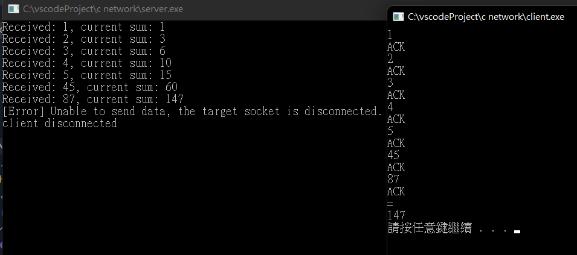

# 第一題：網路加法程式

- client連至server後，client每次輸入一個數字並送給server，直到輸入’='時，server會回傳所有數字的和。
- client不用手動輸入ip與port自動連上server，client輸入並送出數字，server回傳ACK
- 當client輸入=(等號)並送出，server會回傳之前數字的總和
- 當完成一個加總流程，client會斷線，server等待下個client連入



## Server 端程式碼

```c++
#include <iostream>
#include <thread>
#include <set>
#include <vector>
#include "MySocket.hpp"
// compile command:
// g++ $fileName -std=c++17 -I MyLib/header/ -g MyLib/implement/*.cpp -o $fileNameWithoutExt -l ws2_32
using namespace std;

int main() {
    Socket server;
    server.bindTo("127.0.0.1", 1234);
    server.listenConnections(1);

    // keep accept client
    while (true) {
        cout << "Waiting for new client..." << endl;
        Socket client = Socket(server.acceptClient());
        cout << "Client connected!" << endl;
        // keep receive message
        int sum = 0;
        while (true) {
            try {
                string message = client.recvData();
                if (message == "") {
                    break;
                }
                if(message == "=") {
                    client.sendData(to_string(sum));
                    client.close();
                } else {
                    sum += stoi(message);
                    cout << "Received: " << message << ", current sum: " << sum << endl;
                    client.sendData("ACK");
                }
            } catch(const char* err) {
                break;
            }
            
            
        }
        cout << "client disconnected" << endl;
    }

    return 0;
}
```

## Client 端程式碼
```c++
#include "MySocket.hpp"
#include <thread>
using namespace std;


int main() {
    Socket server;
    server.connectTo("127.0.0.1", 1234);
    string n;
    while(cin >> n) {
        if(n == "=") {
            server.sendData(n);
            string ans = server.recvData();
            cout << ans << endl;
            break;

        } else {
            server.sendData(n);
            cout << server.recvData() << endl;
        }
    }
    server.close();
    WSACleanup();
    system("pause");
    return 0;
}
```