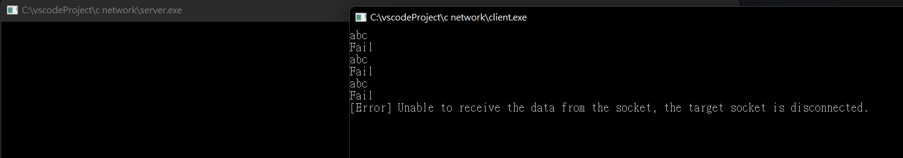
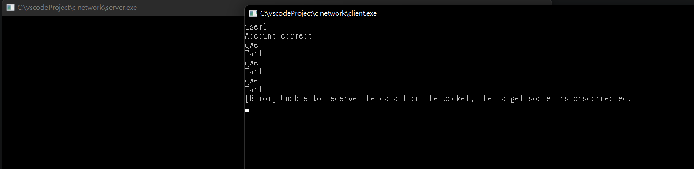
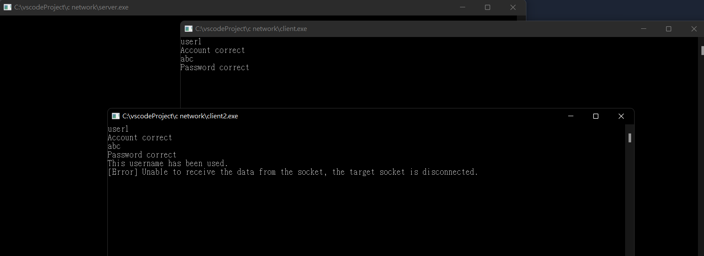
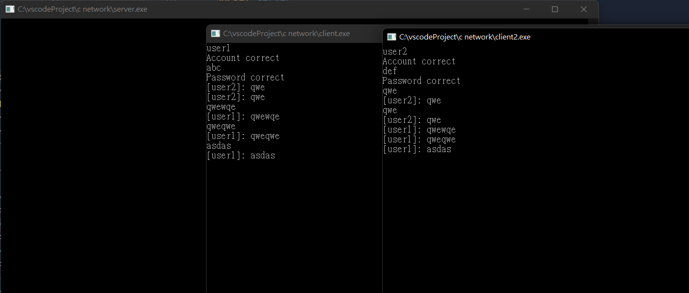

# ee

- 詳細程序如下：
  - server已經建好兩組帳號和密碼
  - 第一組帳號：user1 密碼：abc
  - 第二組帳號：user2 密碼：def。
  - client1登入時，會手動輸入帳號後送給server。
    - server判斷該帳號是否存在，若無則要求重新輸入帳號，若有才要求輸入密碼。
    - client1可使用兩組帳密其中一組，都可成功登入。
    - 若client輸入帳號錯誤三次，立即斷線。
  - clien1手動輸入密碼後，送給server。
    - server會判斷密碼是否正確，若正確可進入聊天室
    - 若密碼輸入錯誤會要求重新輸入密碼。輸入密碼錯誤三次，立即斷線。
  - 當client1登入成功，接著client2依以上步驟及規則登入。
    - 當client2使用的帳號及密碼，與client1相同時，server會偵測相同帳號重複登入，將client2斷線。
  - 兩client使用不同帳號成功登入後，可以正常聊天

- [x] client 1連至server，輸入帳號後，server能回覆帳號是否正確
- [x] client1輸入帳號錯誤3次，立即斷線
- [x] client1輸入帳號正確後，判斷密碼是否正確
- [x] client1輸入密碼錯誤3次，立即斷線
- [x] client1登入完成，輪到client2也可依上述過程登入
- [x] server可判斷若是client1與client2同一帳號，第2個登入時會斷線
- [x] 兩client使用不同帳號成功登入後，可以正常聊天









## Server 端程式碼

```c++
#include <iostream>
#include <thread>
#include <set>
#include <vector>
#include <map>
#include "MySocket.hpp"
// compile command:
// g++ $fileName -std=c++17 -I MyLib/header/ -g MyLib/implement/*.cpp -o $fileNameWithoutExt -l ws2_32
using namespace std;

map<string, string> users = {
    {"user1", "abc"},
    {"user2", "def"}
};

pair<bool, string> login(Socket& client) {
    // handle account
    string account;
    for(int i = 1; i <= 3; i++) {
        account = client.recvData();
        if(users.find(account) == users.end()) {
            client.sendData("Fail");
            if(i == 3) {
                return make_pair(false, "");
            }
            continue;
        }
        break;
    }
    client.sendData("Account correct");
    // handle password
    for(int i = 1; i <= 3; i++) {
        string password = client.recvData();
        if(password != users[account]) {
            client.sendData("Fail");
            if(i == 3) {
                return make_pair(false, "");
            }
            continue;
        }
        break;
    }
    client.sendData("Password correct");
    return make_pair(true, account);
}

Socket* c1 = nullptr;
Socket* c2 = nullptr;
void broadcast(string data) {
    c1->sendData(data);
    c2->sendData(data);
}

void handleClient(Socket* client) {
    while(true) {
        string data = client->recvData();
        if(client == c1) {
            data = "[user1]: " + data;
        } else {
            data = "[user2]: " + data;
        }
        broadcast(data);
    }
}

void startChat(Socket& cli1, Socket& cli2) {
    c1 = &cli1;
    c2 = &cli2;
    thread t1(handleClient, &cli1);
    thread t2(handleClient, &cli2);
    t1.join();
    t2.join();
}

int main() {
    Socket server;
    server.bindTo("127.0.0.1", 1234);
    server.listenConnections(2);

    while(true) {
        
        string currentUser1Account = "";
        string currentUser2Account = "";
        Socket* client1;
        Socket* client2;
        try {
            while(true) {
                client1 = new Socket(server.acceptClient());
                pair<bool, string> loginResult = login(*client1);
                if(!loginResult.first) {
                    delete client1;
                    continue;
                }
                currentUser1Account = loginResult.second;
                break;
            }

            while(true) {
                client2 = new Socket(server.acceptClient());
                pair<bool, string> loginResult = login(*client2);
                if(!loginResult.first) {
                    continue;
                } else if(loginResult.second == currentUser1Account) {
                    client2->sendData("This username has been used.");
                    delete client2;
                    continue;
                }
                currentUser2Account = loginResult.second;
                break;
            }

            startChat(*client1, *client2);
        } catch(const char* err) {
            cout << err << endl;
        }
        
    }

    system("pause");
    return 0;
}

```

## Client 端

```c++
#include "MySocket.hpp"
#include <thread>
using namespace std;

// handle recv
void listenFromServer(Socket* mySocket) {
    while(true) {
        try {
            string s = mySocket->recvData();
            cout << s << endl;
        } catch(const char* err) {
            cout << err << endl;
            
            break;
        }
    }
}

int main() {
    Socket server;
    server.connectTo("127.0.0.1", 1234);
    // thread to listen from server
    thread t(listenFromServer, &server);
    string data;
    while(true) {
        getline(cin, data);
        server.sendData(data);
    }
    WSACleanup();
    system("pause");
    return 0;
}

```